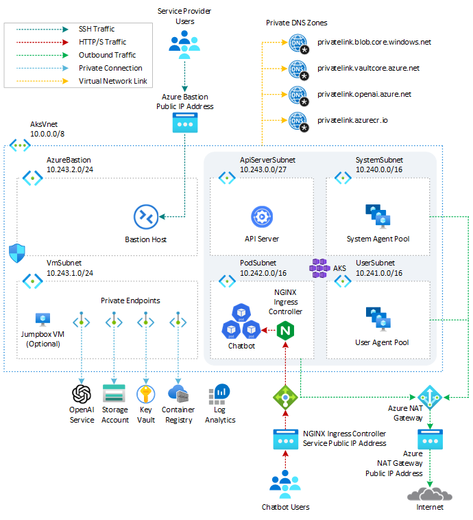

# How to deploy and run an Azure OpenAI ChatGPT application on AKS via Terraform

This sample shows how to deploy an [Azure Kubernetes Service(AKS)](https://docs.microsoft.com/en-us/azure/aks/intro-kubernetes) cluster and [Azure OpenAI Service](https://learn.microsoft.com/en-us/azure/cognitive-services/openai/overview) using [Terraform](https://www.terraform.io/) modules with the [Azure Provider](https://registry.terraform.io/providers/hashicorp/azurerm/latest/docs) Terraform Provider and how to deploy a Python chatbot that authenticates against Azure OpenAI using [Azure AD workload identity](https://learn.microsoft.com/en-us/azure/aks/workload-identity-overview) and calls the [Chat Completion API](https://platform.openai.com/docs/api-reference/chat) of a [ChatGPT model](https://learn.microsoft.com/en-us/azure/cognitive-services/openai/concepts/models#chatgpt-gpt-35-turbo). For a Bicep version of the demo, see [How to deploy and run an Azure OpenAI ChatGPT application on AKS via Bicep](https://github.com/Azure-Samples/aks-openai).

A chatbot is an application that simulates human-like conversations with users via chat. Its key task is to answer user questions with instant messages. [Azure Kubernetes Service(AKS)](https://docs.microsoft.com/en-us/azure/aks/intro-kubernetes) cluster communicates with [Azure OpenAI Service](https://learn.microsoft.com/en-us/azure/cognitive-services/openai/overview) via an [Azure Private Endpoint](https://docs.microsoft.com/en-us/azure/private-link/private-endpoint-overview). The chatbot application simulates the original [Magic 8 Ball](https://en.wikipedia.org/wiki/Magic_8_Ball) plastic sphere, made to look like an oversized eight ball, that is used for fortune-telling or seeking advice.


AI applications can be used to perform tasks such as [summarizing articles](https://www.zdnet.com/article/how-to-use-chatgpt-to-summarize-a-book-article-or-research-paper/), writing stories, and engaging in long conversations with chatbots. This is made possible by [large language models (LLMs)](https://en.wikipedia.org/wiki/Large_language_model) like OpenAI ChatGPT, which are deep learning algorithms capable of recognizing, summarizing, translating, predicting, and generating text and other content. LLMs leverage the knowledge acquired from extensive datasets, enabling them to perform tasks that go beyond teaching AI human languages. These models have found success in diverse domains, including understanding proteins, writing software code, and more. Apart from their applications in natural language processing, such as translation, chatbots, and AI assistants, large language models are also extensively employed in healthcare, software development, and various other fields.

For more information on Azure OpenAI Service and Large Language Models (LLMs), see the following articles:

- [What is Azure OpenAI Service?](https://learn.microsoft.com/en-us/azure/cognitive-services/openai/overview)
- [Azure OpenAI Service models](https://learn.microsoft.com/en-us/azure/cognitive-services/openai/concepts/models)
- [Large Language Model](https://en.wikipedia.org/wiki/Large_language_model)
- [Azure OpenAI Terraform deployment for sample chatbot](https://github.com/Azure-Samples/azure-openai-terraform-deployment-sample/)
- [Terraform module for deploying Azure OpenAI Service.](https://registry.terraform.io/modules/Azure/openai/azurerm/latest)

## Prerequisites

- An active [Azure subscription](https://docs.microsoft.com/en-us/azure/guides/developer/azure-developer-guide#understanding-accounts-subscriptions-and-billing). If you don't have one, create a [free Azure account](https://azure.microsoft.com/free/) before you begin.
- [Visual Studio Code](https://code.visualstudio.com/) installed on one of the [supported platforms](https://code.visualstudio.com/docs/supporting/requirements#_platforms) along with the [HashiCorp Terraform](https://marketplace.visualstudio.com/items?itemName=HashiCorp.terraform).
- Azure CLI version 2.49.0 or later installed. To install or upgrade, see [Install Azure CLI](https://learn.microsoft.com/en-us/cli/azure/install-azure-cli).
- `aks-preview` Azure CLI extension of version 0.5.140 or later installed

You can run `az --version` to verify above versions.

To install the aks-preview extension, run the following command:

```bash
az extension add --name aks-preview
```

Run the following command to update to the latest version of the extension released:

```bash
az extension update --name aks-preview
```

## Architecture

This sample provides a set of Terraform modules to deploy an [Azure Kubernetes Service(AKS)](https://docs.microsoft.com/en-us/azure/aks/intro-kubernetes) cluster and [Azure OpenAI Service](https://learn.microsoft.com/en-us/azure/cognitive-services/openai/overview) and how to deploy a Python chatbot that authenticates against Azure OpenAI using [Azure AD workload identity](https://learn.microsoft.com/en-us/azure/aks/workload-identity-overview) and calls the [Chat Completion API](https://platform.openai.com/docs/api-reference/chat) of the [ChatGPT model](https://learn.microsoft.com/en-us/azure/cognitive-services/openai/concepts/models#chatgpt-gpt-35-turbo). [Azure Kubernetes Service(AKS)](https://docs.microsoft.com/en-us/azure/aks/intro-kubernetes) cluster communicates with [Azure OpenAI Service](https://learn.microsoft.com/en-us/azure/cognitive-services/openai/overview) via an [Azure Private Endpoint](https://docs.microsoft.com/en-us/azure/private-link/private-endpoint-overview). The following diagram shows the architecture and network topology deployed by the sample:



Terraform modules are parametric, so you can choose any network plugin:

- [Azure CNI with static IP allocation](https://learn.microsoft.com/en-us/azure/aks/configure-azure-cni)
- [Azure CNI with dynamic IP allocation](https://learn.microsoft.com/en-us/azure/aks/configure-azure-cni-dynamic-ip-allocation)
- [Azure CNI Powered by Cilium](https://learn.microsoft.com/en-us/azure/aks/azure-cni-powered-by-cilium)
- [Azure CNI Overlay](https://learn.microsoft.com/en-us/azure/aks/azure-cni-overlay)
- [BYO CNI](https://learn.microsoft.com/en-us/azure/aks/use-byo-cni?tabs=azure-cli)
- [Kubenet](https://learn.microsoft.com/en-us/azure/aks/configure-kubenet)

In a production environment, we strongly recommend deploying a [private AKS cluster](https://docs.microsoft.com/en-us/azure/aks/private-clusters) with [Uptime SLA](https://docs.microsoft.com/en-us/azure/aks/uptime-sla). For more information, see [private AKS cluster with a Public DNS address](https://docs.microsoft.com/en-us/azure/aks/private-clusters#create-a-private-aks-cluster-with-a-public-dns-address). Alternatively, you can deploy a public AKS cluster and secure access to the API server using [authorized IP address ranges](https://learn.microsoft.com/en-us/azure/aks/api-server-authorized-ip-ranges).

The Terraform modules deploy the following Azure resources:

- [Azure OpenAI Service](https://registry.terraform.io/providers/hashicorp/azurerm/latest/docs/resources/cognitive_account): an [Azure OpenAI Service](https://learn.microsoft.com/en-us/azure/cognitive-services/openai/overview) with a [GPT-3.5](https://learn.microsoft.com/en-us/azure/cognitive-services/openai/concepts/models#chatgpt-gpt-35-turbo) model used by the chatbot application. Azure OpenAI Service gives customers advanced language AI with OpenAI GPT-4, GPT-3, Codex, and DALL-E models with the security and enterprise promise of Azure. Azure OpenAI co-develops the APIs with OpenAI, ensuring compatibility and a smooth transition from one to the other.
- [User-defined Managed Identity](https://registry.terraform.io/providers/hashicorp/azurerm/latest/docs/resources/user_assigned_identity): a user-defined managed identity used by the AKS cluster to create additional resources like load balancers and managed disks in Azure.
- [User-defined Managed Identity](https://registry.terraform.io/providers/hashicorp/azurerm/latest/docs/resources/user_assigned_identity): a user-defined managed identity used by the chatbot application to acquire a security token via [Azure AD workload identity](https://learn.microsoft.com/en-us/azure/aks/workload-identity-overview) to call the [Chat Completion API](https://platform.openai.com/docs/api-reference/chat) of the [ChatGPT model](https://learn.microsoft.com/en-us/azure/cognitive-services/openai/concepts/models#chatgpt-gpt-35-turbo) provided by the [Azure OpenAI Service](https://learn.microsoft.com/en-us/azure/cognitive-services/openai/overview).
- [Azure Virtual Machine](https://registry.terraform.io/providers/hashicorp/azurerm/latest/docs/resources/linux_virtual_machine): Terraform modules can optionally create a jump-box virtual machine to manage the private AKS cluster.
- [Azure Bastion Host](https://registry.terraform.io/providers/hashicorp/azurerm/latest/docs/resources/bastion_host): a separate Azure Bastion is deployed in the AKS cluster virtual network to provide SSH connectivity to both agent nodes and virtual machines.
- [Azure NAT Gateway](https://registry.terraform.io/providers/hashicorp/azurerm/latest/docs/resources/nat_gateway): a bring-your-own (BYO) [Azure NAT Gateway](https://learn.microsoft.com/en-us/azure/virtual-network/nat-gateway/nat-overview) to manage outbound connections initiated by AKS-hosted workloads. The NAT Gateway is associated to the `SystemSubnet`, `UserSubnet`, and `PodSubnet` subnets. The [outboundType](https://learn.microsoft.com/en-us/azure/aks/egress-outboundtype#outbound-type-of-managednatgateway-or-userassignednatgateway) property of the cluster is set to `userAssignedNatGateway` to specify that a BYO NAT Gateway is used for outbound connections. NOTE: you can update the `outboundType` after cluster creation and this will deploy or remove resources as required to put the cluster into the new egress configuration. For more information, see [Updating outboundType after cluster creation](https://learn.microsoft.com/en-us/azure/aks/egress-outboundtype#updating-outboundtype-after-cluster-creation-preview).
- [Azure Storage Account](https://registry.terraform.io/providers/hashicorp/azurerm/latest/docs/resources/storage_account): this storage account is used to store the boot diagnostics logs of both the service provider and service consumer virtual machines. Boot Diagnostics is a debugging feature that allows you to view console output and screenshots to diagnose virtual machine status.
- [Azure Container Registry](https://registry.terraform.io/providers/hashicorp/azurerm/latest/docs/resources/container_registry): an Azure Container Registry (ACR) to build, store, and manage container images and artifacts in a private registry for all container deployments.
- [Azure Key Vault](https://registry.terraform.io/providers/hashicorp/azurerm/latest/docs/resources/key_vault): an Azure Key Vault used to store secrets, certificates, and keys that can be mounted as files by pods using [Azure Key Vault Provider for Secrets Store CSI Driver](https://github.com/Azure/secrets-store-csi-driver-provider-azure). For more information, see [Use the Azure Key Vault Provider for Secrets Store CSI Driver in an AKS cluster](https://learn.microsoft.com/en-us/azure/aks/csi-secrets-store-driver) and [Provide an identity to access the Azure Key Vault Provider for Secrets Store CSI Driver](https://learn.microsoft.com/en-us/azure/aks/csi-secrets-store-identity-access).
- [Azure Private Endpoints](https://registry.terraform.io/providers/hashicorp/azurerm/latest/docs/resources/private_endpoint): an [Azure Private Endpoint](https://docs.microsoft.com/en-us/azure/private-link/private-endpoint-overview) is created for each of the following resources:
  - Azure OpenAI Service
  - Azure Container Registry
  - Azure Key Vault
  - Azure Storage Account
  - API Server when deploying a private AKS cluster.
- [Azure Private DNDS Zones](https://registry.terraform.io/providers/hashicorp/azurerm/latest/docs/data-sources/private_dns_zone): an [Azure Private DNS Zone](https://docs.microsoft.com/en-us/azure/dns/private-dns-overview) is created for each of the following resources:
  - Azure OpenAI Service
  - Azure Container Registry
  - Azure Key Vault
  - Azure Storage Account
  - API Server when deploying a private AKS cluster.
- [Azure Network Security Group](https://registry.terraform.io/providers/hashicorp/azurerm/latest/docs/data-sources/network_security_group): subnets hosting virtual machines and Azure Bastion Hosts are protected by [Azure Network Security Groups](https://docs.microsoft.com/en-us/azure/virtual-network/network-security-groups-overview) that are used to filter inbound and outbound traffic.
- [Azure Log Analytics Workspace](https://registry.terraform.io/providers/hashicorp/azurerm/latest/docs/resources/log_analytics_workspace): a centralized [Azure Log Analytics](https://docs.microsoft.com/en-us/azure/azure-monitor/logs/log-analytics-workspace-overview) workspace is used to collect the diagnostics logs and metrics from all the Azure resources:
  - Azure OpenAI Service
  - Azure Kubernetes Service cluster
  - Azure Key Vault
  - Azure Network Security Group
  - Azure Container Registry
  - Azure Storage Account
  - Azure jump-box virtual machine
- [Azure Deployment Script](https://registry.terraform.io/providers/hashicorp/azurerm/latest/docs/resources/resource_deployment_script_azure_cli): a deployment script is used to run the `install-nginx-via-helm-and-create-sa.sh` Bash script which creates the namespace and service account for the sample application and installs the following packages to the AKS cluster via [Helm](https://helm.sh/). For more information on deployment scripts, see [Use deployment scripts](https://registry.terraform.io/providers/hashicorp/azurerm/latest/docs/resources/resource_deployment_script_azure_cli)
  - [NGINX Ingress Controller](https://docs.nginx.com/nginx-ingress-controller/)
  - [Cert-Manager](https://cert-manager.io/docs/)
  - [Prometheus](https://prometheus.io/)

> **NOTE**  
> You can find the `architecture.vsdx` file used for the diagram under the `visio` folder.

## Azure Provider

The [Azure Provider](https://registry.terraform.io/providers/hashicorp/azurerm/latest/docs) can be used to configure infrastructure in [Microsoft Azure](https://azure.microsoft.com/en-us/) using the Azure Resource Manager API's. For more information on the [data sources](https://www.terraform.io/docs/configuration/data-sources.html) and [resources](https://www.terraform.io/docs/configuration/resources.html) supported by the Azure Provider, see the [documentation](https://registry.terraform.io/providers/hashicorp/azurerm/latest/docs). To learn the basics of Terraform using this provider, follow the hands-on [get started tutorials](https://learn.hashicorp.com/tutorials/terraform/infrastructure-as-code?in=terraform/azure-get-started). If you are interested in the [Azure Provider](https://registry.terraform.io/providers/hashicorp/azurerm/latest/docs)'s latest features, see the [changelog](https://github.com/hashicorp/terraform-provider-azurerm/blob/main/CHANGELOG.md) for version information and release notes.

## What is Azure OpenAI Service?

The [Azure OpenAI Service](https://learn.microsoft.com/en-us/azure/cognitive-services/openai/overview) is a platform offered by Microsoft Azure that provides cognitive services powered by [OpenAI](https://openai.com/) models. One of the models available through this service is the [ChatGPT](https://learn.microsoft.com/en-us/azure/cognitive-services/openai/concepts/models#gpt-4-models) model, which is designed for interactive conversational tasks. It allows developers to integrate natural language understanding and generation capabilities into their applications.

Azure OpenAI Service provides REST API access to OpenAI's powerful language models including the [GPT-3](https://learn.microsoft.com/en-us/azure/cognitive-services/openai/concepts/models#gpt-3-models), [Codex](https://learn.microsoft.com/en-us/azure/cognitive-services/openai/concepts/models#codex-models) and [Embeddings](https://learn.microsoft.com/en-us/azure/cognitive-services/openai/concepts/models#codex-models) model series. In addition, the new [GPT-4](https://learn.microsoft.com/en-us/azure/cognitive-services/openai/concepts/models#gpt-4-models) and [ChatGPT](https://learn.microsoft.com/en-us/azure/cognitive-services/openai/concepts/models#chatgpt-gpt-35-turbo) model series have now reached general availability. These models can be easily adapted to your specific task including but not limited to content generation, summarization, semantic search, and natural language to code translation. Users can access the service through REST APIs, Python SDK, or our web-based interface in the Azure OpenAI Studio.

The [Chat Completion API](https://platform.openai.com/docs/api-reference/chat/create), which is part of the Azure OpenAI Service, provides a dedicated interface for interacting with the [ChatGPT](https://learn.microsoft.com/en-us/azure/cognitive-services/openai/concepts/models#chatgpt-gpt-35-turbo) and [GPT-4 models](https://learn.microsoft.com/en-us/azure/cognitive-services/openai/concepts/models#gpt-4-models). This API is currently in preview and is the preferred method for accessing these models. The GPT-4 models can only be accessed through this API.

[GPT-3](https://learn.microsoft.com/en-us/azure/cognitive-services/openai/concepts/models#gpt-3-models), [GPT-3.5](https://learn.microsoft.com/en-us/azure/cognitive-services/openai/concepts/models#chatgpt-gpt-35-turbo), and [GPT-4](https://learn.microsoft.com/en-us/azure/cognitive-services/openai/concepts/models#gpt-4-models) models from OpenAI are prompt-based. With prompt-based models, the user interacts with the model by entering a text prompt, to which the model responds with a text completion. This completion is the model’s continuation of the input text. While these models are extremely powerful, their behavior is also very sensitive to the prompt. This makes prompt construction an important skill to develop. For more information, see [Introduction to prompt engineering](https://learn.microsoft.com/en-us/azure/cognitive-services/openai/concepts/prompt-engineering).

Prompt construction can be difficult. In practice, the prompt acts to configure the model weights to complete the desired task, but it's more of an art than a science, often requiring experience and intuition to craft a successful prompt. The goal of this article is to help get you started with this learning process. It attempts to capture general concepts and patterns that apply to all GPT models. However it's important to understand that each model behaves differently, so the learnings may not apply equally to all models.

Prompt engineering refers to the process of creating instructions called prompts for Large Language Models (LLMs), such as OpenAI’s ChatGPT. With the immense potential of LLMs to solve a wide range of tasks, leveraging prompt engineering can empower us to save significant time and facilitate the development of impressive applications. It holds the key to unleashing the full capabilities of these huge models, transforming how we interact and benefit from them. For more information, see [Prompt engineering techniques](https://learn.microsoft.com/en-us/azure/cognitive-services/openai/concepts/advanced-prompt-engineering?pivots=programming-language-chat-completions).

## Deploy the Terraform modules

Before deploying the Terraform modules in the `terraform` folder, specify a value for the following variables in the [terraform.tfvars](https://developer.hashicorp.com/terraform/language/values/variables#variable-definitions-tfvars-files) variable definitions file.

```terraform
name_prefix            = "magic8ball"
domain                 = "contoso.com"
subdomain              = "magic"
namespace              = "magic8ball"
service_account_name   = "magic8ball-sa"
ssh_public_key         = "XXXXXXX"
vm_enabled             = true
location               = "westeurope"
admin_group_object_ids = ["XXXXXXXX-XXXX-XXXX-XXXX-XXXXXXXXXXXX"] 
```

**Description**

- `prefix`: specifies a prefix for all the Azure resources.
- `domain`: specifies the domain part (e.g., subdomain.domain) of the hostname of the ingress object used to expose the chatbot via the [NGINX Ingress Controller](https://docs.nginx.com/nginx-ingress-controller/).
- `subdomain`: specifies the subdomain part of the hostname of the ingress object used to expose the chatbot via the [NGINX Ingress Controller](https://docs.nginx.com/nginx-ingress-controller/).
- `namespace`: specifies the namespace of the workload application that accesses the Azure OpenAI Service.
- `service_account_name`: specifies the name of the service account of the workload application that accesses the Azure OpenAI Service.
- `ssh_public_key`: specifies the SSH public key used for the AKS nodes and jumpbox virtual machine.
- `vm_enabled`: a boleean value that specifies whether deploying or not a jumpbox virtual machine in the same virtual network of the AKS cluster.
- `location`: specifies the region (e.g., westeurope) where deploying the Azure resources.
- `admin_group_object_ids`: when deploying an AKS cluster with Azure AD and Azure RBAC integration, this array parameter contains the list of Azure AD group object IDs that will have the admin role of the cluster.

We suggest reading sensitive configuration data such as passwords or SSH keys from a pre-existing Azure Key Vault resource. For more information, see [Referencing Azure Key Vault secrets in Terraform](https://thomasthornton.cloud/2022/02/26/referencing-azure-key-vault-secrets-in-terraform/).

Before proceeding, also make sure to run the `register-preview-features.sh` Bash script in the `terraform` folder to register any preview feature used by the AKS cluster.

## OpenAI Terraform Module

The following table contains the code from the `openai.tf` Terraform module used to deploy the [Azure OpenAI Service](https://registry.terraform.io/providers/hashicorp/azurerm/latest/docs/resources/cognitive_account).

```terraform
resource "azurerm_cognitive_account" "openai" {
  name                          = var.name
  location                      = var.location
  resource_group_name           = var.resource_group_name
  kind                          = "OpenAI"
  custom_subdomain_name         = var.custom_subdomain_name
  sku_name                      = var.sku_name
  public_network_access_enabled = var.public_network_access_enabled
  tags                          = var.tags

  identity {
    type = "SystemAssigned"
  }

  lifecycle {
    ignore_changes = [
      tags
    ]
  }
}

resource "azurerm_cognitive_deployment" "deployment" {
  for_each             = {for deployment in var.deployments: deployment.name => deployment}

  name                 = each.key
  cognitive_account_id = azurerm_cognitive_account.openai.id

  model {
    format  = "OpenAI"
    name    = each.value.model.name
    version = each.value.model.version
  }

  scale {
    type = "Standard"
  }
}

resource "azurerm_monitor_diagnostic_setting" "settings" {
  name                       = "DiagnosticsSettings"
  target_resource_id         = azurerm_cognitive_account.openai.id
  log_analytics_workspace_id = var.log_analytics_workspace_id

  enabled_log {
    category = "Audit"

    retention_policy {
      enabled = true
      days    = var.log_analytics_retention_days
    }
  }

  enabled_log {
    category = "RequestResponse"

    retention_policy {
      enabled = true
      days    = var.log_analytics_retention_days
    }
  }

  enabled_log {
    category = "Trace"

    retention_policy {
      enabled = true
      days    = var.log_analytics_retention_days
    }
  }

  metric {
    category = "AllMetrics"

    retention_policy {
      enabled = true
      days    = var.log_analytics_retention_days
    }
  }
}
```

Azure Cognitive Services use custom subdomain names for each resource created through the [Azure portal](https://portal.azure.com), [Azure Cloud Shell](https://azure.microsoft.com/features/cloud-shell/), [Azure CLI](/cli/azure/install-azure-cli), [Bicep](https://docs.microsoft.com/en-us/azure/azure-resource-manager/bicep/overview), [Azure Resource Manager (ARM)](https://learn.microsoft.com/en-us/azure/azure-resource-manager/management/overview), or [Terraform](https://registry.terraform.io/providers/hashicorp/azurerm/latest/docs/resources/cognitive_account). Unlike regional endpoints, which were common for all customers in a specific Azure region, custom subdomain names are unique to the resource. Custom subdomain names are required to enable features like Azure Active Directory (Azure AD) for authentication. In our case, we need to specify a custom subdomain for our [Azure OpenAI Service](https://registry.terraform.io/providers/hashicorp/azurerm/latest/docs/resources/cognitive_account) as our chatbot application will use an Azure AD security token to access it. By default, the `main.tf` module sets the value of the `custom_subdomain_name` parameter to the lowercase name of the Azure OpenAI resource. For more information on custom subdomains, see [Custom subdomain names for Cognitive Services](https://learn.microsoft.com/en-us/azure/cognitive-services/cognitive-services-custom-subdomains?source=docs).

This terraform module allows you to pass an array containing the definition of one or more model deployments in the `deployments` parameter. For more information on model deployments, see [Create a resource and deploy a model using Azure OpenAI](https://learn.microsoft.com/en-us/azure/cognitive-services/openai/how-to/create-resource?pivots=web-portal).

As an alternative, you can use the [Terraform module for deploying Azure OpenAI Service.](https://registry.terraform.io/modules/Azure/openai/azurerm/latest) to deploy an [Azure OpenAI Service](https://registry.terraform.io/providers/hashicorp/azurerm/latest/docs/resources/cognitive_account).

## Private Endpoints

The `main.tf` module creates [Azure Private Endpoints](https://registry.terraform.io/providers/hashicorp/azurerm/latest/docs/resources/private_endpoint) and [Azure Private DNDS Zones](https://registry.terraform.io/providers/hashicorp/azurerm/latest/docs/data-sources/private_dns_zone) for each of the following resources:

- Azure OpenAI Service
- Azure Container Registry
- Azure Key Vault
- Azure Storage Account

In particular, it creates an [Azure Private Endpoint](https://registry.terraform.io/providers/hashicorp/azurerm/latest/docs/resources/private_endpoint) and [Azure Private DNDS Zone](https://registry.terraform.io/providers/hashicorp/azurerm/latest/docs/data-sources/private_dns_zone) to the [Azure OpenAI Service](https://registry.terraform.io/providers/hashicorp/azurerm/latest/docs/resources/cognitive_account) as shown in the following code snippet:

```terraform
module "openai_private_dns_zone" {
  source                       = "./modules/private_dns_zone"
  name                         = "privatelink.openai.azure.com"
  resource_group_name          = azurerm_resource_group.rg.name
  tags                         = var.tags
  virtual_networks_to_link     = {
    (module.virtual_network.name) = {
      subscription_id = data.azurerm_client_config.current.subscription_id
      resource_group_name = azurerm_resource_group.rg.name
    }
  }
}

module "openai_private_endpoint" {
  source                         = "./modules/private_endpoint"
  name                           = "${module.openai.name}PrivateEndpoint"
  location                       = var.location
  resource_group_name            = azurerm_resource_group.rg.name
  subnet_id                      = module.virtual_network.subnet_ids[var.vm_subnet_name]
  tags                           = var.tags
  private_connection_resource_id = module.openai.id
  is_manual_connection           = false
  subresource_name               = "account"
  private_dns_zone_group_name    = "AcrPrivateDnsZoneGroup"
  private_dns_zone_group_ids     = [module.acr_private_dns_zone.id]
}
```

Below you can read the code of the `private_dns_zone` and `private_endpoint` modules used, respectively, to create the [Azure Private Endpoints](https://registry.terraform.io/providers/hashicorp/azurerm/latest/docs/resources/private_endpoint) and [Azure Private DNDS Zones](https://registry.terraform.io/providers/hashicorp/azurerm/latest/docs/data-sources/private_dns_zone).

**private_dns_zone**

```terraform
resource "azurerm_private_dns_zone" "private_dns_zone" {
  name                = var.name
  resource_group_name = var.resource_group_name
  tags                = var.tags

  lifecycle {
    ignore_changes = [
      tags
    ]
  }
}

resource "azurerm_private_dns_zone_virtual_network_link" "link" {
  for_each = var.virtual_networks_to_link

  name                  = "link_to_${lower(basename(each.key))}"
  resource_group_name   = var.resource_group_name
  private_dns_zone_name = azurerm_private_dns_zone.private_dns_zone.name
  virtual_network_id    = "/subscriptions/${each.value.subscription_id}/resourceGroups/${each.value.resource_group_name}/providers/Microsoft.Network/virtualNetworks/${each.key}"

  lifecycle {
    ignore_changes = [
      tags
    ]
  }
}
```

**private_endpoint**

```terraform
resource "azurerm_private_endpoint" "private_endpoint" {
  name                = var.name
  location            = var.location
  resource_group_name = var.resource_group_name
  subnet_id           = var.subnet_id
  tags                = var.tags

  private_service_connection {
    name                           = "${var.name}Connection"
    private_connection_resource_id = var.private_connection_resource_id
    is_manual_connection           = var.is_manual_connection
    subresource_names              = try([var.subresource_name], null)
    request_message                = try(var.request_message, null)
  }

  private_dns_zone_group {
    name                 = var.private_dns_zone_group_name
    private_dns_zone_ids = var.private_dns_zone_group_ids
  }

  lifecycle {
    ignore_changes = [
      tags
    ]
  }
}
```

## AKS Workload User-Defined Managed Identity

The following code snippet from the `main.tf` Terraform module creates the user-defined managed identity used by the chatbot to acquire a security token from Azure Active Directory via [Azure AD workload identity](https://learn.microsoft.com/en-us/azure/aks/workload-identity-overview).

```terraform
resource "azurerm_user_assigned_identity" "aks_workload_identity" {
  name                = var.name_prefix == null ? "${random_string.prefix.result}${var.workload_managed_identity_name}" : "${var.name_prefix}${var.workload_managed_identity_name}"
  resource_group_name = azurerm_resource_group.rg.name
  location            = var.location
  tags                = var.tags

  lifecycle {
    ignore_changes = [
      tags
    ]
  }
}

resource "azurerm_role_assignment" "cognitive_services_user_assignment" {
  scope                = module.openai.id
  role_definition_name = "Cognitive Services User"
  principal_id         = azurerm_user_assigned_identity.aks_workload_identity.principal_id
  skip_service_principal_aad_check = true
}

resource "azurerm_federated_identity_credential" "federated_identity_credential" {
  name                = "${title(var.namespace)}FederatedIdentity"
  resource_group_name = azurerm_resource_group.rg.name
  audience            = ["api://AzureADTokenExchange"]
  issuer              = module.aks_cluster.oidc_issuer_url
  parent_id           = azurerm_user_assigned_identity.aks_workload_identity.id
  subject             = "system:serviceaccount:${var.namespace}:${var.service_account_name}"
}
```

The above code snippet performs the following steps:

- Creates a new user-defined managed identity.
- Assign the new managed identity to the Cognitive Services User role with the resource group as a scope.
- Federate the managed identity with the service account used by the chatbot. The following information is necessary to create the federated identity credentials:
  - The Kubernetes service account name.
  - The Kubernetes namespace that will host the chatbot application.
  - The URL of the OpenID Connect (OIDC) token issuer endpoint for [Azure AD workload identity](https://learn.microsoft.com/en-us/azure/aks/workload-identity-overview)

For more information, see the following resources:

- [How to configure Azure OpenAI Service with managed identities](https://learn.microsoft.com/en-us/azure/cognitive-services/openai/how-to/managed-identity)
- [Use Azure AD workload identity with Azure Kubernetes Service (AKS)](https://learn.microsoft.com/en-us/azure/aks/workload-identity-overview)

## Validate the deployment

Open the Azure Portal, and navigate to the resource group. Open the Azure Open AI Service resource, navigate to `Keys and Endpoint`, and check that the endpoint contains a custom subdomain rather than the regional Cognitive Services endpoint.


Open to the `<Prefix>WorkloadManagedIdentity` managed identity, navigate to the `Federated credentials`, and verify that the federated identity credentials for the `magic8ball-sa` service account were created correctly, as shown in the following picture.


## Use Azure AD workload identity with Azure Kubernetes Service (AKS)

Workloads deployed on an Azure Kubernetes Services (AKS) cluster require Azure Active Directory (Azure AD) application credentials or managed identities to access Azure AD protected resources, such as Azure Key Vault and Microsoft Graph. Azure AD workload identity integrates with the capabilities native to Kubernetes to federate with external identity providers.

[Azure AD workload identity](https://learn.microsoft.com/en-us/azure/active-directory/develop/workload-identities-overview) uses [Service Account Token Volume Projection](https://kubernetes.io/docs/tasks/configure-pod-container/configure-service-account/#serviceaccount-token-volume-projection) to enable pods to use a Kubernetes service account. When enabled, the [AKS OIDC Issuer](https://learn.microsoft.com/en-us/azure/aks/use-oidc-issuer) issues a service account security token to a workload and [OIDC federation](https://kubernetes.io/docs/reference/access-authn-authz/authentication/#openid-connect-tokens) enables the application to access Azure resources securely with Azure AD based on annotated service accounts.

Azure AD workload identity works well with the [Azure Identity client libraries](#azure-identity-client-libraries) and the [Microsoft Authentication Library (MSAL)](https://learn.microsoft.com/en-us/azure/active-directory/develop/msal-overview) collection if you use a [registered application](https://learn.microsoft.com/en-us/azure/active-directory/develop/application-model#register-an-application) instead of a managed identity. Your workload can use any of these libraries to seamlessly authenticate and access Azure cloud resources.

For more information, see the following resources:

- [Azure Workload Identity open-source project](https://azure.github.io/azure-workload-identity)
- [Use an Azure AD workload identity on Azure Kubernetes Service (AKS](https://learn.microsoft.com/en-us/azure/aks/workload-identity-overview)
- [Deploy and configure workload identity on an Azure Kubernetes Service (AKS) cluster](https://learn.microsoft.com/en-us/azure/aks/workload-identity-deploy-cluster)
- [Modernize application authentication with workload identity sidecar](https://learn.microsoft.com/en-us/azure/aks/workload-identity-migration-sidecar)
- [Tutorial: Use a workload identity with an application on Azure Kubernetes Service (AKS)](https://learn.microsoft.com/en-us/azure/aks/learn/tutorial-kubernetes-workload-identity)
- [Workload identity federation](https://docs.microsoft.com/azure/active-directory/develop/workload-identity-federation)
- [Use Azure AD Workload Identity for Kubernetes with a User-Assigned Managed Identity](https://techcommunity.microsoft.com/t5/fasttrack-for-azure/use-azure-ad-workload-identity-for-kubernetes-with-a-user/ba-p/3654928)
- [Use Azure AD workload identity for Kubernetes with an Azure AD registered application](https://techcommunity.microsoft.com/t5/fasttrack-for-azure/use-azure-ad-workload-identity-for-kubernetes-in-a-net-standard/ba-p/3576218)
- [Azure Managed Identities with Workload Identity Federation](https://blog.identitydigest.com/azuread-federate-mi/)
- [Azure AD workload identity federation with Kubernetes](https://blog.identitydigest.com/azuread-federate-k8s/)
- [Azure Active Directory Workload Identity Federation with external OIDC Identy Providers](https://arsenvlad.medium.com/azure-active-directory-workload-identity-federation-with-external-oidc-idp-4f06c9205a26)
- [Minimal Azure AD Workload identity federation](https://cookbook.geuer-pollmann.de/azure/workload-identity-federation)

## Azure Identity client libraries

In the Azure Identity client libraries, you can choose one of the following approaches:

- Use `DefaultAzureCredential`, which will attempt to use the `WorkloadIdentityCredential`.
- Create a `ChainedTokenCredential` instance that includes `WorkloadIdentityCredential`.
- Use `WorkloadIdentityCredential` directly.

The following table provides the **minimum** package version required for each language's client library.

| Language   | Library                                                                                      | Minimum Version | Example                                                                                           |
|------------|----------------------------------------------------------------------------------------------|-----------------|---------------------------------------------------------------------------------------------------|
| .NET       | [Azure.Identity](/dotnet/api/overview/azure/identity-readme)      | 1.9.0    | [Link](https://github.com/Azure/azure-workload-identity/tree/main/examples/azure-identity/dotnet) |
| Go         | [azidentity](https://pkg.go.dev/github.com/Azure/azure-sdk-for-go/sdk/azidentity)            | 1.3.0    | [Link](https://github.com/Azure/azure-workload-identity/tree/main/examples/azure-identity/go)     |
| Java       | [azure-identity](/java/api/overview/azure/identity-readme)        | 1.9.0    | [Link](https://github.com/Azure/azure-workload-identity/tree/main/examples/azure-identity/java)   |
| JavaScript | [@azure/identity](/javascript/api/overview/azure/identity-readme) | 3.2.0    | [Link](https://github.com/Azure/azure-workload-identity/tree/main/examples/azure-identity/node)   |
| Python     | [azure-identity](/python/api/overview/azure/identity-readme)      | 1.13.0        | [Link](https://github.com/Azure/azure-workload-identity/tree/main/examples/azure-identity/python) |

## Microsoft Authentication Library (MSAL)

The following client libraries are the **minimum** version required

| Language | Library | Image | Example | Has Windows |
|-----------|-----------|----------|----------|----------|
| .NET | [microsoft-authentication-library-for-dotnet](https://github.com/AzureAD/microsoft-authentication-library-for-dotnet) | ghcr.io/azure/azure-workload-identity/msal-net | [Link](https://github.com/Azure/azure-workload-identity/tree/main/examples/msal-net/akvdotnet) | Yes |
| Go | [microsoft-authentication-library-for-go](https://github.com/AzureAD/microsoft-authentication-library-for-go) | ghcr.io/azure/azure-workload-identity/msal-go | [Link](https://github.com/Azure/azure-workload-identity/tree/main/examples/msal-go) | Yes |
| Java | [microsoft-authentication-library-for-java](https://github.com/AzureAD/microsoft-authentication-library-for-java) | ghcr.io/azure/azure-workload-identity/msal-java | [Link](https://github.com/Azure/azure-workload-identity/tree/main/examples/msal-java) | No |
| JavaScript | [microsoft-authentication-library-for-js](https://github.com/AzureAD/microsoft-authentication-library-for-js) | ghcr.io/azure/azure-workload-identity/msal-node | [Link](https://github.com/Azure/azure-workload-identity/tree/main/examples/msal-node) | No |
| Python | [microsoft-authentication-library-for-python](https://github.com/AzureAD/microsoft-authentication-library-for-python) | ghcr.io/azure/azure-workload-identity/msal-python | [Link](https://github.com/Azure/azure-workload-identity/tree/main/examples/msal-python) | No |

## Deployment Script

The sample makes use of a [Deployment Script](https://registry.terraform.io/providers/hashicorp/azurerm/latest/docs/resources/resource_deployment_script_azure_cli) to run the `install-nginx-via-helm-and-create-sa.sh` Bash script that creates the namespace and service account for the sample application and installs the following packages to the AKS cluster via [Helm](https://helm.sh/).

- [NGINX Ingress Controller](https://docs.nginx.com/nginx-ingress-controller/)
- [Cert-Manager](https://cert-manager.io/docs/)
- [Prometheus](https://prometheus.io/)

This sample uses the [NGINX Ingress Controller](https://docs.nginx.com/nginx-ingress-controller/) to expose the chatbot to the public internet.

```bash
# Install kubectl
az aks install-cli --only-show-errors

# Get AKS credentials
az aks get-credentials \
  --admin \
  --name $clusterName \
  --resource-group $resourceGroupName \
  --subscription $subscriptionId \
  --only-show-errors

# Check if the cluster is private or not
private=$(az aks show --name $clusterName \
  --resource-group $resourceGroupName \
  --subscription $subscriptionId \
  --query apiServerAccessProfile.enablePrivateCluster \
  --output tsv)

# Install Helm
curl https://raw.githubusercontent.com/helm/helm/main/scripts/get-helm-3 -o get_helm.sh -s
chmod 700 get_helm.sh
./get_helm.sh &>/dev/null

# Add Helm repos
helm repo add prometheus-community https://prometheus-community.github.io/helm-charts
helm repo add ingress-nginx https://kubernetes.github.io/ingress-nginx
helm repo add jetstack https://charts.jetstack.io

# Update Helm repos
helm repo update

if [[ $private == 'true' ]]; then
  # Log whether the cluster is public or private
  echo "$clusterName AKS cluster is public"

  # Install Prometheus
  command="helm install prometheus prometheus-community/kube-prometheus-stack \
  --create-namespace \
  --namespace prometheus \
  --set prometheus.prometheusSpec.podMonitorSelectorNilUsesHelmValues=false \
  --set prometheus.prometheusSpec.serviceMonitorSelectorNilUsesHelmValues=false"

  az aks command invoke \
    --name $clusterName \
    --resource-group $resourceGroupName \
    --subscription $subscriptionId \
    --command "$command"

  # Install NGINX ingress controller using the internal load balancer
  command="helm install nginx-ingress ingress-nginx/ingress-nginx \
    --create-namespace \
    --namespace ingress-basic \
    --set controller.replicaCount=3 \
    --set controller.nodeSelector.\"kubernetes\.io/os\"=linux \
    --set defaultBackend.nodeSelector.\"kubernetes\.io/os\"=linux \
    --set controller.metrics.enabled=true \
    --set controller.metrics.serviceMonitor.enabled=true \
    --set controller.metrics.serviceMonitor.additionalLabels.release=\"prometheus\" \
    --set controller.service.annotations.\"service\.beta\.kubernetes\.io/azure-load-balancer-health-probe-request-path\"=/healthz"

  az aks command invoke \
    --name $clusterName \
    --resource-group $resourceGroupName \
    --subscription $subscriptionId \
    --command "$command"

  # Install certificate manager
  command="helm install cert-manager jetstack/cert-manager \
    --create-namespace \
    --namespace cert-manager \
    --set installCRDs=true \
    --set nodeSelector.\"kubernetes\.io/os\"=linux"

  az aks command invoke \
    --name $clusterName \
    --resource-group $resourceGroupName \
    --subscription $subscriptionId \
    --command "$command"

  # Create cluster issuer
  command="cat <<EOF | kubectl apply -f -
apiVersion: cert-manager.io/v1
kind: ClusterIssuer
metadata:
  name: letsencrypt-nginx
spec:
  acme:
    server: https://acme-v02.api.letsencrypt.org/directory
    email: $email
    privateKeySecretRef:
      name: letsencrypt
    solvers:
    - http01:
        ingress:
          class: nginx
          podTemplate:
            spec:
              nodeSelector:
                "kubernetes.io/os": linux
EOF"

  az aks command invoke \
    --name $clusterName \
    --resource-group $resourceGroupName \
    --subscription $subscriptionId \
    --command "$command"

  # Create workload namespace
  command="kubectl create namespace $namespace"

  az aks command invoke \
    --name $clusterName \
    --resource-group $resourceGroupName \
    --subscription $subscriptionId \
    --command "$command"

  # Create service account
  command="cat <<EOF | kubectl apply -f -
apiVersion: v1
kind: ServiceAccount
metadata:
  annotations:
    azure.workload.identity/client-id: $workloadManagedIdentityClientId
    azure.workload.identity/tenant-id: $tenantId
  labels:
    azure.workload.identity/use: "true"
  name: $serviceAccountName
  namespace: $namespace
EOF"

  az aks command invoke \
    --name $clusterName \
    --resource-group $resourceGroupName \
    --subscription $subscriptionId \
    --command "$command"

else
  # Log whether the cluster is public or private
  echo "$clusterName AKS cluster is private"

  # Install Prometheus
  helm install prometheus prometheus-community/kube-prometheus-stack \
    --create-namespace \
    --namespace prometheus \
    --set prometheus.prometheusSpec.podMonitorSelectorNilUsesHelmValues=false \
    --set prometheus.prometheusSpec.serviceMonitorSelectorNilUsesHelmValues=false

  # Install NGINX ingress controller using the internal load balancer
  helm install nginx-ingress ingress-nginx/ingress-nginx \
    --create-namespace \
    --namespace ingress-basic \
    --set controller.replicaCount=3 \
    --set controller.nodeSelector."kubernetes\.io/os"=linux \
    --set defaultBackend.nodeSelector."kubernetes\.io/os"=linux \
    --set controller.metrics.enabled=true \
    --set controller.metrics.serviceMonitor.enabled=true \
    --set controller.metrics.serviceMonitor.additionalLabels.release="prometheus" \
    --set controller.service.annotations."service\.beta\.kubernetes\.io/azure-load-balancer-health-probe-request-path"=/healthz

  helm install $nginxReleaseName $nginxRepoName/$nginxChartName \
    --create-namespace \
    --namespace $nginxNamespace

  # Install certificate manager
  helm install cert-manager jetstack/cert-manager \
    --create-namespace \
    --namespace cert-manager \
    --set installCRDs=true \
    --set nodeSelector."kubernetes\.io/os"=linux

  # Create cluster issuer
  cat <<EOF | kubectl apply -f -
apiVersion: cert-manager.io/v1
kind: ClusterIssuer
metadata:
  name: letsencrypt-nginx
spec:
  acme:
    server: https://acme-v02.api.letsencrypt.org/directory
    email: $email
    privateKeySecretRef:
      name: letsencrypt
    solvers:
    - http01:
        ingress:
          class: nginx
          podTemplate:
            spec:
              nodeSelector:
                "kubernetes.io/os": linux
EOF

  # Create workload namespace
  kubectl create namespace $namespace

  # Create service account
  cat <<EOF | kubectl apply -f -
apiVersion: v1
kind: ServiceAccount
metadata:
  annotations:
    azure.workload.identity/client-id: $workloadManagedIdentityClientId
    azure.workload.identity/tenant-id: $tenantId
  labels:
    azure.workload.identity/use: "true"
  name: $serviceAccountName
  namespace: $namespace
EOF

fi

# Create output as JSON file
echo '{}' |
  jq --arg x $namespace '.namespace=$x' |
  jq --arg x $serviceAccountName '.serviceAccountName=$x' |
  jq --arg x 'prometheus' '.prometheus=$x' |
  jq --arg x 'cert-manager' '.certManager=$x' |
  jq --arg x 'ingress-basic' '.nginxIngressController=$x' >$AZ_SCRIPTS_OUTPUT_PATH
```

The `install-nginx-via-helm-and-create-sa.sh` Bash script can run on a public AKS cluster or on a private AKS cluster using the [az aks command invoke](<https://learn.microsoft.com/en-us/cli/azure/aks/command?view=azure-cli-latest#az-aks-command-invoke>). For more information, see [Use command invoke to access a private Azure Kubernetes Service (AKS) cluster](https://learn.microsoft.com/en-us/azure/aks/command-invoke).

The `install-nginx-via-helm-and-create-sa.sh` Bash script returns the following outputs to the deployment script:

- Namespace hosting the chatbot sample. You can change the default `magic8ball` namespace by assigning a different value to the `namespace` variable in the `terraform.tfvars` file.
- Service account name
- Prometheus namespace
- Cert-manager namespace
- NGINX ingress controller namespace

You can find the `install-nginx-via-helm-and-create-sa.sh` file under the `terraform` folder.

## Chatbot Application

The chatbot is a Python application inspired by the sample code in the [It’s Time To Create A Private ChatGPT For Yourself Today](https://levelup.gitconnected.com/its-time-to-create-a-private-chatgpt-for-yourself-today-6503649e7bb6) arctiel. The application is contained in a single file called `app.py`. The application makes use of the following libraries:

- [OpenAPI](https://github.com/openai/openai-python): The OpenAI Python library provides convenient access to the OpenAI API from applications written in the Python language. It includes a pre-defined set of classes for API resources that initialize themselves dynamically from API responses which makes it compatible with a wide range of versions of the OpenAI API. You can find usage examples for the OpenAI Python library in our [API reference](https://beta.openai.com/docs/api-reference?lang=python) and the [OpenAI Cookbook](https://github.com/openai/openai-cookbook/).
- [Azure Identity](https://learn.microsoft.com/en-us/python/api/overview/azure/identity-readme?view=azure-python): The Azure Identity library provides [Azure Active Directory (Azure AD)](https://learn.microsoft.com/en-us/azure/active-directory/fundamentals/active-directory-whatis) token authentication support across the Azure SDK. It provides a set of [TokenCredential](https://learn.microsoft.com/en-us/python/api/azure-core/azure.core.credentials.tokencredential?view=azure-python) implementations, which can be used to construct Azure SDK clients that support Azure AD token authentication.
- [Streamlit](https://github.com/streamlit/streamlit): Streamlit is an open-source Python library that makes it easy to create and share beautiful, custom web apps for machine learning and data science. In just a few minutes you can build and deploy powerful data apps. For more information, see [Streamlit documentation](https://docs.streamlit.io/)
- [Streamlit-chat](https://github.com/AI-Yash/st-chat): a Streamlit component that provides a configurable user interface for chatbot applications.
- [Dotenv](https://github.com/theskumar/python-dotenv): Python-dotenv reads key-value pairs from a .env file and can set them as environment variables. It helps in the development of applications following the [12-factor](http://12factor.net/) principles.

The `requirements.txt` file under the `scripts` folder contains the list of packages used by the `app.py` application that you can restore using the following command:

```bash
pip install -r requirements.txt --upgrade
```

The following table contains the code of the `app.py` chatbot:

```python
# Import packages
import os
import sys
import time
import openai
import logging
import streamlit as st
from streamlit_chat import message
from azure.identity import DefaultAzureCredential
from dotenv import load_dotenv
from dotenv import dotenv_values

# Load environment variables from .env file
if os.path.exists(".env"):
  load_dotenv(override=True)
  config = dotenv_values(".env")

# Read environment variables
assistan_profile = """
You are the infamous Magic 8 Ball. You need to randomly reply to any question with one of the following answers:

- It is certain.
- It is decidedly so.
- Without a doubt.
- Yes definitely.
- You may rely on it.
- As I see it, yes.
- Most likely.
- Outlook good.
- Yes.
- Signs point to yes.
- Reply hazy, try again.
- Ask again later.
- Better not tell you now.
- Cannot predict now.
- Concentrate and ask again.
- Don't count on it.
- My reply is no.
- My sources say no.
- Outlook not so good.
- Very doubtful.

Add a short comment in a pirate style at the end! Follow your heart and be creative! 
For mor information, see https://en.wikipedia.org/wiki/Magic_8_Ball
"""
title = os.environ.get("TITLE", "Magic 8 Ball")
text_input_label = os.environ.get("TEXT_INPUT_LABEL", "Pose your question and cross your fingers!")
image_file_name = os.environ.get("IMAGE_FILE_NAME", "magic8ball.png")
image_width = int(os.environ.get("IMAGE_WIDTH", 80))
temperature = float(os.environ.get("TEMPERATURE", 0.9))
system = os.environ.get("SYSTEM", assistan_profile)
api_base = os.getenv("AZURE_OPENAI_BASE")
api_key = os.getenv("AZURE_OPENAI_KEY")
api_type = os.environ.get("AZURE_OPENAI_TYPE", "azure")
api_version = os.environ.get("AZURE_OPENAI_VERSION", "2023-05-15")
engine = os.getenv("AZURE_OPENAI_DEPLOYMENT")
model = os.getenv("AZURE_OPENAI_MODEL")

# Configure OpenAI
openai.api_type = api_type
openai.api_version = api_version
openai.api_base = api_base 

# Set default Azure credential
default_credential = DefaultAzureCredential() if openai.api_type == "azure_ad" else None

# Configure a logger
logging.basicConfig(stream = sys.stdout, 
                    format = '[%(asctime)s] {%(filename)s:%(lineno)d} %(levelname)s - %(message)s',
                    level = logging.INFO)
logger = logging.getLogger(__name__)

# Log variables
logger.info(f"title: {title}")
logger.info(f"text_input_label: {text_input_label}")
logger.info(f"image_file_name: {image_file_name}")
logger.info(f"image_width: {image_width}")
logger.info(f"temperature: {temperature}")
logger.info(f"system: {system}")
logger.info(f"api_base: {api_base}")
logger.info(f"api_key: {api_key}")
logger.info(f"api_type: {api_type}")
logger.info(f"api_version: {api_version}")
logger.info(f"engine: {engine}")
logger.info(f"model: {model}")

# Authenticate to Azure OpenAI
if openai.api_type == "azure":
  openai.api_key = api_key
elif openai.api_type == "azure_ad":
  openai_token = default_credential.get_token("https://cognitiveservices.azure.com/.default")
  openai.api_key = openai_token.token
  if 'openai_token' not in st.session_state:
    st.session_state['openai_token'] = openai_token
else:
  logger.error("Invalid API type. Please set the AZURE_OPENAI_TYPE environment variable to azure or azure_ad.")
  raise ValueError("Invalid API type. Please set the AZURE_OPENAI_TYPE environment variable to azure or azure_ad.")

# Customize Streamlit UI using CSS
st.markdown("""
<style>

div.stButton > button:first-child {
    background-color: #eb5424;
    color: white;
    font-size: 20px;
    font-weight: bold;
    border-radius: 0.5rem;
    padding: 0.5rem 1rem;
    border: none;
    box-shadow: 0 0.5rem 1rem rgba(0,0,0,0.15);
    width: 300 px;
    height: 42px;
    transition: all 0.2s ease-in-out;
} 

div.stButton > button:first-child:hover {
    transform: translateY(-3px);
    box-shadow: 0 1rem 2rem rgba(0,0,0,0.15);
}

div.stButton > button:first-child:active {
    transform: translateY(-1px);
    box-shadow: 0 0.5rem 1rem rgba(0,0,0,0.15);
}

div.stButton > button:focus:not(:focus-visible) {
    color: #FFFFFF;
}

@media only screen and (min-width: 768px) {
  /* For desktop: */
  div {
      font-family: 'Roboto', sans-serif;
  }

  div.stButton > button:first-child {
      background-color: #eb5424;
      color: white;
      font-size: 20px;
      font-weight: bold;
      border-radius: 0.5rem;
      padding: 0.5rem 1rem;
      border: none;
      box-shadow: 0 0.5rem 1rem rgba(0,0,0,0.15);
      width: 300 px;
      height: 42px;
      transition: all 0.2s ease-in-out;
      position: relative;
      bottom: -32px;
      right: 0px;
  } 

  div.stButton > button:first-child:hover {
      transform: translateY(-3px);
      box-shadow: 0 1rem 2rem rgba(0,0,0,0.15);
  }

  div.stButton > button:first-child:active {
      transform: translateY(-1px);
      box-shadow: 0 0.5rem 1rem rgba(0,0,0,0.15);
  }

  div.stButton > button:focus:not(:focus-visible) {
      color: #FFFFFF;
  }

  input {
      border-radius: 0.5rem;
      padding: 0.5rem 1rem;
      border: none;
      box-shadow: 0 0.5rem 1rem rgba(0,0,0,0.15);
      transition: all 0.2s ease-in-out;
      height: 40px;
  }
}
</style>
""", unsafe_allow_html=True)

# Initialize Streamlit session state
if 'prompts' not in st.session_state:
  st.session_state['prompts'] = [{"role": "system", "content": system}]

if 'generated' not in st.session_state:
  st.session_state['generated'] = []

if 'past' not in st.session_state:
  st.session_state['past'] = []

# Refresh the OpenAI security token every 45 minutes
def refresh_openai_token():
  if st.session_state['openai_token'].expires_on < int(time.time()) - 45 * 60:
      st.session_state['openai_token'] = default_credential.get_token("https://cognitiveservices.azure.com/.default")
      openai.api_key = st.session_state['openai_token'].token

# Send user prompt to Azure OpenAI 
def generate_response(prompt):
  try:
    st.session_state['prompts'].append({"role": "user", "content": prompt})

    if openai.api_type == "azure_ad":
      refresh_openai_token()

    completion = openai.ChatCompletion.create(
      engine = engine,
      model = model,
      messages = st.session_state['prompts'],
      temperature = temperature,
    )
    
    message = completion.choices[0].message.content
    return message
  except Exception as e:
    logging.exception(f"Exception in generate_response: {e}")

# Reset Streamlit session state to start a new chat from scratch
def new_click():
  st.session_state['prompts'] = [{"role": "system", "content": system}]
  st.session_state['past'] = []
  st.session_state['generated'] = []
  st.session_state['user'] = ""

# Handle on_change event for user input
def user_change():
  # Avoid handling the event twice when clicking the Send button
  chat_input = st.session_state['user']
  st.session_state['user'] = ""
  if (chat_input == '' or
      (len(st.session_state['past']) > 0 and chat_input == st.session_state['past'][-1])):
    return
  
  # Generate response invoking Azure OpenAI LLM
  if chat_input !=  '':
    output = generate_response(chat_input)
    
    # store the output
    st.session_state['past'].append(chat_input)
    st.session_state['generated'].append(output)
    st.session_state['prompts'].append({"role": "assistant", "content": output})

# Create a 2-column layout. Note: Streamlit columns do not properly render on mobile devices.
# For more information, see https://github.com/streamlit/streamlit/issues/5003
col1, col2 = st.columns([1, 7])

# Display the robot image
with col1:
  st.image(image = os.path.join("images", image_file_name), width = image_width)

# Display the title
with col2:
  st.title(title)

# Create a 3-column layout. Note: Streamlit columns do not properly render on mobile devices.
# For more information, see https://github.com/streamlit/streamlit/issues/5003
col3, col4, col5 = st.columns([7, 1, 1])

# Create text input in column 1
with col3:
  user_input = st.text_input(text_input_label, key = "user", on_change = user_change)

# Create send button in column 2
with col4:
  st.button(label = "Send")

# Create new button in column 3
with col5:
  st.button(label = "New", on_click = new_click)

# Display the chat history in two separate tabs
# - normal: display the chat history as a list of messages using the streamlit_chat message() function 
# - rich: display the chat history as a list of messages using the Streamlit markdown() function
if st.session_state['generated']:
  tab1, tab2 = st.tabs(["normal", "rich"])
  with tab1:
    for i in range(len(st.session_state['generated']) - 1, -1, -1):
      message(st.session_state['past'][i], is_user = True, key = str(i) + '_user', avatar_style = "fun-emoji", seed = "Nala")
      message(st.session_state['generated'][i], key = str(i), avatar_style = "bottts", seed = "Fluffy")
  with tab2:
    for i in range(len(st.session_state['generated']) - 1, -1, -1):
      st.markdown(st.session_state['past'][i])
      st.markdown(st.session_state['generated'][i])
```

The application makes use of an [internal cascading style sheet (CSS)](https://www.javatpoint.com/internal-css) inside an [st.markdown](https://docs.streamlit.io/library/api-reference/text/st.markdown) element to add a unique style to the Streamlit chatbot for mobile and desktop devices. For more information on how to tweak the user interface of a Streamlit application, see [3 Tips to Customize your Streamlit App](https://python.plainenglish.io/three-tips-to-improve-your-streamlit-app-a4c94b4d2b30).

```bash
streamlit run app.py
```

## Working with the ChatGPT and GPT-4 models

The `generate_response` function creates and sends the prompt to the [Chat Completion API](https://platform.openai.com/docs/api-reference/chat) of the [ChatGPT model](https://learn.microsoft.com/en-us/azure/cognitive-services/openai/concepts/models#chatgpt-gpt-35-turbo).

```python
def generate_response(prompt):
  try:
    st.session_state['prompts'].append({"role": "user", "content": prompt})

    if openai.api_type == "azure_ad":
      refresh_openai_token()

    completion = openai.ChatCompletion.create(
      engine = engine,
      model = model,
      messages = st.session_state['prompts'],
      temperature = temperature,
    )
    
    message = completion.choices[0].message.content
    return message
  except Exception as e:
    logging.exception(f"Exception in generate_response: {e}")
```

OpenAI trained the ChatGPT and GPT-4 models to accept input formatted as a conversation. The messages parameter takes an array of dictionaries with a conversation organized by role or message: system, user, and assistant. The format of a basic Chat Completion is as follows:

```json
{"role": "system", "content": "Provide some context and/or instructions to the model"},
{"role": "user", "content": "The users messages goes here"},
{"role": "assistant", "content": "The response message goes here."}
```

The `system` role also known as the system message is included at the beginning of the array. This message provides the initial instructions to the model. You can provide various information in the system role including:

- A brief description of the assistant
- Personality traits of the assistant
- Instructions or rules you would like the assistant to follow
- Data or information needed for the model, such as relevant questions from an FAQ
- You can customize the system role for your use case or just include basic instructions.

The `system` role or message is optional, but it's recommended to at least include a basic one to get the best results. The `user` role or message represents an input or inquiry from the user, while the `assistant` message corresponds to the response generated by the GPT API. This dialog exchange aims to simulate a human-like conversation, where the user message initiates the interaction and the assistant message provides a relevant and informative answer. This context helps the chat model generate a more appropriate response later on. The last user message refers to the prompt currently requested.  For more information, see [Learn how to work with the ChatGPT and GPT-4 models](https://learn.microsoft.com/en-us/azure/cognitive-services/openai/how-to/chatgpt?pivots=programming-language-chat-completions).

## Application Configuration

Make sure to provide a value for the following environment variables when testing the `app.py` Python app locally, for example in Visual Studio Code. You can eventually define environment variables in a `.env` file in the same folder as the `app.py` file.

- `AZURE_OPENAI_TYPE`: specify `azure` if you want to let the application use the API key to authenticate against OpenAI. In this case, make sure to provide the Key in the `AZURE_OPENAI_KEY` environment variable. If you want to authenticate using an Azure AD security token, you need to specify `azure_ad` as a value. In this case, don't need to provide any value in the `AZURE_OPENAI_KEY` environment variable.
- `AZURE_OPENAI_BASE`: the URL of your Azure OpenAI resource. If you use the API key to authenticate against OpenAI, you can specify the regional endpoint of your Azure OpenAI Service (e.g., [https://eastus.api.cognitive.microsoft.com/](https://eastus.api.cognitive.microsoft.com/)). If you instead plan to use Azure AD security tokens for authentication, you need to deploy your Azure OpenAI Service with a subdomain and specify the resource-specific endpoint url (e.g., [https://myopenai.openai.azure.com/](https://myopenai.openai.azure.com/)).
- `AZURE_OPENAI_KEY`: the key of your Azure OpenAI resource.
- `AZURE_OPENAI_DEPLOYMENT`: the name of the ChatGPT deployment used by your Azure OpenAI resource, for example `gpt-35-turbo`.
- `AZURE_OPENAI_MODEL`: the name of the ChatGPT model used by your Azure OpenAI resource, for example `gpt-35-turbo`.
- `TITLE`: the title of the Streamlit app.
- `TEMPERATURE`: the temperature used by the OpenAI API to generate the response.
- `SYSTEM`: give the model instructions about how it should behave and any context it should reference when generating a response. Used to describe the assistant's personality.

When deploying the application to Azure Kubernetes Service (AKS) these values are provided in a Kubernetes [ConfigMap](https://kubernetes.io/docs/concepts/configuration/configmap/). For more information, see the next section.

## OpenAI Library

In order to use the `openai` library with Microsoft Azure endpoints, you need to set the `api_type`, `api_base` and `api_version` in addition to the `api_key`. The `api_type` must be set to 'azure' and the others correspond to the properties of your endpoint. In addition, the deployment name must be passed as the engine parameter. In order to use OpenAI Key to authenticate to your Azure endpoint, you need to set the `api_type` to `azure` and pass the OpenAI Key to `api_key`.

```python
import openai
openai.api_type = "azure"
openai.api_key = "..."
openai.api_base = "https://example-endpoint.openai.azure.com"
openai.api_version = "2023-05-15"

# create a chat completion
chat_completion = openai.ChatCompletion.create(deployment_id="gpt-3.5-turbo", model="gpt-3.5-turbo", messages=[{"role": "user", "content": "Hello world"}])

# print the completion
print(completion.choices[0].message.content)
```

For a detailed example of how to use fine-tuning and other operations using Azure endpoints, please check out the following Jupyter notebooks:

- [Using Azure completions](https://github.com/openai/openai-cookbook/tree/main/examples/azure/completions.ipynb)
- [Using Azure fine-tuning](https://github.com/openai/openai-cookbook/tree/main/examples/azure/finetuning.ipynb)
- [Using Azure embeddings](https://github.com/openai/openai-cookbook/blob/main/examples/azure/embeddings.ipynb)

In order to use Microsoft Active Directory to authenticate to your Azure endpoint, you need to set the `api_type` to `azure_ad` and pass the acquired credential token to `api_key`. The rest of the parameters need to be set as specified in the previous section.

```python
from azure.identity import DefaultAzureCredential
import openai

# Request credential
default_credential = DefaultAzureCredential()
token = default_credential.get_token("https://cognitiveservices.azure.com/.default")

# Setup parameters
openai.api_type = "azure_ad"
openai.api_key = token.token
openai.api_base = "https://example-endpoint.openai.azure.com/"
openai.api_version = "2023-05-15"

# ...
```

You can use two different authentication methods in the `magic8ball` chatbot application:

- `API key`: set the `AZURE_OPENAI_TYPE` environment variable to `azure` and the `AZURE_OPENAI_KEY` environment variable to the key of your Azure OpenAI resource. You can use the regional endpoint, such as [https://eastus.api.cognitive.microsoft.com/](https://eastus.api.cognitive.microsoft.com/), in the `AZURE_OPENAI_BASE` environment variable, to connect to the Azure OpenAI resource.
- `Azure Active Directory`: set the `AZURE_OPENAI_TYPE` environment variable to `azure_ad` and use a service principal or managed identity with the [DefaultAzureCredential](https://learn.microsoft.com/en-us/python/api/azure-identity/azure.identity.defaultazurecredential?view=azure-python) object to acquire a security token from Azure Active Directory. For more information on the DefaultAzureCredential in Python, see [Authenticate Python apps to Azure services by using the Azure SDK for Python](https://docs.microsoft.com/en-us/azure/developer/python/azure-sdk-authenticate?tabs=cmd). Make sure to assign the `Cognitive Services User` role to the service principal or managed identity used to authenticate to your Azure OpenAI Service. For more information, see [How to configure Azure OpenAI Service with managed identities](https://learn.microsoft.com/en-us/azure/cognitive-services/openai/how-to/managed-identity). If you want to use Azure AD integrated security, you need to create a custom subdomain for your Azure OpenAI resource and use the specific endpoint containing the custom domain, such as [https://myopenai.openai.azure.com/](https://myopenai.openai.azure.com/) where myopenai is the custom subdomain. If you specify the regional endpoint, you get an error like the following: `Subdomain does not map to a resource`. Hence, pass the custom domain endpoint in the `AZURE_OPENAI_BASE` environment variable. In this case, you also need to refresh the security token periodically.

## Build the container image

You can build the container image using the `Dockerfile` and `01-build-docker-image.sh` in the `scripts` folder.

**Dockefile**

```bash
# app/Dockerfile

# # Stage 1 - Install build dependencies

# A Dockerfile must start with a FROM instruction which sets the base image for the container.
# The Python images come in many flavors, each designed for a specific use case.
# The python:3.11-slim image is a good base image for most applications.
# It is a minimal image built on top of Debian Linux and includes only the necessary packages to run Python.
# The slim image is a good choice because it is small and contains only the packages needed to run Python.
# For more information, see: 
# * https://hub.docker.com/_/python 
# * https://docs.streamlit.io/knowledge-base/tutorials/deploy/docker
FROM python:3.11-slim AS builder

# The WORKDIR instruction sets the working directory for any RUN, CMD, ENTRYPOINT, COPY and ADD instructions that follow it in the Dockerfile.
# If the WORKDIR doesn’t exist, it will be created even if it’s not used in any subsequent Dockerfile instruction.
# For more information, see: https://docs.docker.com/engine/reference/builder/#workdir
WORKDIR /app

# Set environment variables. 
# The ENV instruction sets the environment variable <key> to the value <value>.
# This value will be in the environment of all “descendant” Dockerfile commands and can be replaced inline in many as well.
# For more information, see: https://docs.docker.com/engine/reference/builder/#env
ENV PYTHONDONTWRITEBYTECODE 1
ENV PYTHONUNBUFFERED 1

# Install git so that we can clone the app code from a remote repo using the RUN instruction.
# The RUN comand has 2 forms:
# * RUN <command> (shell form, the command is run in a shell, which by default is /bin/sh -c on Linux or cmd /S /C on Windows)
# * RUN ["executable", "param1", "param2"] (exec form)
# The RUN instruction will execute any commands in a new layer on top of the current image and commit the results. 
# The resulting committed image will be used for the next step in the Dockerfile.
# For more information, see: https://docs.docker.com/engine/reference/builder/#run
RUN apt-get update && apt-get install -y \
    build-essential \
    curl \
    software-properties-common \
    git \
    && rm -rf /var/lib/apt/lists/*

# Create a virtualenv to keep dependencies together
RUN python -m venv /opt/venv
ENV PATH="/opt/venv/bin:$PATH"

# Clone the requirements.txt which contains dependencies to WORKDIR
# COPY has two forms:
# * COPY <src> <dest> (this copies the files from the local machine to the container's own filesystem)
# * COPY ["<src>",... "<dest>"] (this form is required for paths containing whitespace)
# For more information, see: https://docs.docker.com/engine/reference/builder/#copy
COPY requirements.txt .

# Install the Python dependencies
RUN pip install --no-cache-dir --no-deps -r requirements.txt

# Stage 2 - Copy only necessary files to the runner stage

# The FROM instruction initializes a new build stage for the application
FROM python:3.11-slim

# Sets the working directory to /app
WORKDIR /app

# Copy the virtual environment from the builder stage
COPY --from=builder /opt/venv /opt/venv

# Set environment variables
ENV PATH="/opt/venv/bin:$PATH"

# Clone the app.py containing the application code
COPY app.py .

# Copy the images folder to WORKDIR
# The ADD instruction copies new files, directories or remote file URLs from <src> and adds them to the filesystem of the image at the path <dest>.
# For more information, see: https://docs.docker.com/engine/reference/builder/#add
ADD images ./images

# The EXPOSE instruction informs Docker that the container listens on the specified network ports at runtime.
# For more information, see: https://docs.docker.com/engine/reference/builder/#expose
EXPOSE 8501

# The HEALTHCHECK instruction has two forms:
# * HEALTHCHECK [OPTIONS] CMD command (check container health by running a command inside the container)
# * HEALTHCHECK NONE (disable any healthcheck inherited from the base image)
# The HEALTHCHECK instruction tells Docker how to test a container to check that it is still working. 
# This can detect cases such as a web server that is stuck in an infinite loop and unable to handle new connections, 
# even though the server process is still running. For more information, see: https://docs.docker.com/engine/reference/builder/#healthcheck
HEALTHCHECK CMD curl --fail http://localhost:8501/_stcore/health

# The ENTRYPOINT instruction has two forms:
# * ENTRYPOINT ["executable", "param1", "param2"] (exec form, preferred)
# * ENTRYPOINT command param1 param2 (shell form)
# The ENTRYPOINT instruction allows you to configure a container that will run as an executable.
# For more information, see: https://docs.docker.com/engine/reference/builder/#entrypoint
ENTRYPOINT ["streamlit", "run", "app.py", "--server.port=8501", "--server.address=0.0.0.0"]
```

**01-build-docker-image.sh**

```bash
#!/bin/bash

# Variables
source ./00-variables.sh

# Build the docker image
docker build -t $imageName:$tag -f Dockerfile .
```

Before running any script, make sure to customize the value of the variables inside the `00-variables.sh` file. This file is embedded in all the scripts and contains the following variables:

```bash
# Variables
acrName="CoralAcr"
acrResourceGrougName="CoralRG"
location="FranceCentral"
attachAcr=false
imageName="magic8ball"
tag="v2"
containerName="magic8ball"
image="$acrName.azurecr.io/$imageName:$tag"
imagePullPolicy="IfNotPresent" # Always, Never, IfNotPresent
managedIdentityName="OpenAiManagedIdentity"
federatedIdentityName="Magic8BallFederatedIdentity"

# Azure Subscription and Tenant
subscriptionId=$(az account show --query id --output tsv)
subscriptionName=$(az account show --query name --output tsv)
tenantId=$(az account show --query tenantId --output tsv)

# Parameters
title="Magic 8 Ball"
label="Pose your question and cross your fingers!"
temperature="0.9"
imageWidth="80"

# OpenAI
openAiName="CoralOpenAi "
openAiResourceGroupName="CoralRG"
openAiType="azure_ad"
openAiBase="https://coralopenai.openai.azure.com/"
openAiModel="gpt-35-turbo"
openAiDeployment="gpt-35-turbo"

# Nginx Ingress Controller
nginxNamespace="ingress-basic"
nginxRepoName="ingress-nginx"
nginxRepoUrl="https://kubernetes.github.io/ingress-nginx"
nginxChartName="ingress-nginx"
nginxReleaseName="nginx-ingress"
nginxReplicaCount=3

# Certificate Manager
cmNamespace="cert-manager"
cmRepoName="jetstack"
cmRepoUrl="https://charts.jetstack.io"
cmChartName="cert-manager"
cmReleaseName="cert-manager"

# Cluster Issuer
email="paolos@microsoft.com"
clusterIssuerName="letsencrypt-nginx"
clusterIssuerTemplate="cluster-issuer.yml"

# AKS Cluster
aksClusterName="CoralAks"
aksResourceGroupName="CoralRG"

# Sample Application
namespace="magic8ball"
serviceAccountName="magic8ball-sa"
deploymentTemplate="deployment.yml"
serviceTemplate="service.yml"
configMapTemplate="configMap.yml"
secretTemplate="secret.yml"

# Ingress and DNS
ingressTemplate="ingress.yml"
ingressName="magic8ball-ingress"
dnsZoneName="contoso.com"
dnsZoneResourceGroupName="DnsResourceGroup"
subdomain="magic8ball"
host="$subdomain.$dnsZoneName"
```

## Upload Docker container image to Azure Container Registry (ACR)

You can push the Docker container image to Azure Container Registry (ACR) using the `03-push-docker-image.sh` script in the `scripts` folder.

**03-push-docker-image.sh**

```bash
#!/bin/bash

# Variables
source ./00-variables.sh

# Login to ACR
az acr login --name $acrName 

# Retrieve ACR login server. Each container image needs to be tagged with the loginServer name of the registry. 
loginServer=$(az acr show --name $acrName --query loginServer --output tsv)

# Tag the local image with the loginServer of ACR
docker tag ${imageName,,}:$tag $loginServer/${imageName,,}:$tag

# Push latest container image to ACR
docker push $loginServer/${imageName,,}:$tag
```

## Deployment Scripts

If you deployed the Azure infrastructure using the Terraform modules provided with this sample, you only need to deploy the application using the following scripts and YAML templates in the `scripts` folder.

**Scripts**

- `09-deploy-app.sh`
- `10-create-ingress.sh`
- `11-configure-dns.sh`

**YAML manifests**

- `configMap.yml`
- `deployment.yml`
- `ingress.yml`
- `service.yml`

If you instead want to deploy the application in your AKS cluster, you can use the following scripts to configure your environment.

**04-create-nginx-ingress-controller.sh** 

This script installs the `NGINX Ingress Controller` using Helm.

```bash
#!/bin/bash

# Variables
source ./00-variables.sh

# Use Helm to deploy an NGINX ingress controller
result=$(helm list -n $nginxNamespace | grep $nginxReleaseName | awk '{print $1}')

if [[ -n $result ]]; then
  echo "[$nginxReleaseName] ingress controller already exists in the [$nginxNamespace] namespace"
else
  # Check if the ingress-nginx repository is not already added
  result=$(helm repo list | grep $nginxRepoName | awk '{print $1}')

  if [[ -n $result ]]; then
    echo "[$nginxRepoName] Helm repo already exists"
  else
    # Add the ingress-nginx repository
    echo "Adding [$nginxRepoName] Helm repo..."
    helm repo add $nginxRepoName $nginxRepoUrl
  fi

  # Update your local Helm chart repository cache
  echo 'Updating Helm repos...'
  helm repo update

  # Deploy NGINX ingress controller
  echo "Deploying [$nginxReleaseName] NGINX ingress controller to the [$nginxNamespace] namespace..."
  helm install $nginxReleaseName $nginxRepoName/$nginxChartName \
    --create-namespace \
    --namespace $nginxNamespace \
    --set controller.config.enable-modsecurity=true \
    --set controller.config.enable-owasp-modsecurity-crs=true \
    --set controller.config.modsecurity-snippet=\
'SecRuleEngine On
SecRequestBodyAccess On
SecAuditLog /dev/stdout
SecAuditLogFormat JSON
SecAuditEngine RelevantOnly
SecRule REMOTE_ADDR "@ipMatch 127.0.0.1" "id:87,phase:1,pass,nolog,ctl:ruleEngine=Off"' \
    --set controller.metrics.enabled=true \
    --set controller.metrics.serviceMonitor.enabled=true \
    --set controller.metrics.serviceMonitor.additionalLabels.release="prometheus" \
    --set controller.nodeSelector."kubernetes\.io/os"=linux \
    --set controller.replicaCount=$replicaCount \
    --set defaultBackend.nodeSelector."kubernetes\.io/os"=linux \
    --set controller.service.annotations."service\.beta\.kubernetes\.io/azure-load-balancer-health-probe-request-path"=/healthz
fi
```

**05-install-cert-manager.sh**

This script installs the `cert-manager` using Helm.

```bash
#/bin/bash

# Variables
source ./00-variables.sh

# Check if the ingress-nginx repository is not already added
result=$(helm repo list | grep $cmRepoName | awk '{print $1}')

if [[ -n $result ]]; then
  echo "[$cmRepoName] Helm repo already exists"
else
  # Add the Jetstack Helm repository
  echo "Adding [$cmRepoName] Helm repo..."
  helm repo add $cmRepoName $cmRepoUrl
fi

# Update your local Helm chart repository cache
echo 'Updating Helm repos...'
helm repo update

# Install cert-manager Helm chart
result=$(helm list -n $cmNamespace | grep $cmReleaseName | awk '{print $1}')

if [[ -n $result ]]; then
  echo "[$cmReleaseName] cert-manager already exists in the $cmNamespace namespace"
else
  # Install the cert-manager Helm chart
  echo "Deploying [$cmReleaseName] cert-manager to the $cmNamespace namespace..."
  helm install $cmReleaseName $cmRepoName/$cmChartName \
    --create-namespace \
    --namespace $cmNamespace \
    --set installCRDs=true \
    --set nodeSelector."kubernetes\.io/os"=linux
fi
```

**06-create-cluster-issuer.sh**

This script creates a cluster issuer for the `NGINX Ingress Controller` based on the `Let's Encrypt` ACME certificate issuer.

```bash
#/bin/bash

# Variables
source ./00-variables.sh

# Check if the cluster issuer already exists
result=$(kubectl get ClusterIssuer -o json | jq -r '.items[].metadata.name | select(. == "'$clusterIssuerName'")')

if [[ -n $result ]]; then
  echo "[$clusterIssuerName] cluster issuer already exists"
  exit
else
  # Create the cluster issuer
  echo "[$clusterIssuerName] cluster issuer does not exist"
  echo "Creating [$clusterIssuerName] cluster issuer..."
  cat $clusterIssuerTemplate |
    yq "(.spec.acme.email)|="\""$email"\" |
    kubectl apply -f -
fi
```

**07-create-workload-managed-identity.sh**

This script creates the managed identity used by the `magic8ball`chatbot and assigns it the `Cognitive Services User` role on the Azure OpenAI Service.

```bash
#!/bin/bash

# Variables
source ./00-variables.sh

# Check if the user-assigned managed identity already exists
echo "Checking if [$managedIdentityName] user-assigned managed identity actually exists in the [$aksResourceGroupName] resource group..."

az identity show \
  --name $managedIdentityName \
  --resource-group $aksResourceGroupName &>/dev/null

if [[ $? != 0 ]]; then
  echo "No [$managedIdentityName] user-assigned managed identity actually exists in the [$aksResourceGroupName] resource group"
  echo "Creating [$managedIdentityName] user-assigned managed identity in the [$aksResourceGroupName] resource group..."

  # Create the user-assigned managed identity
  az identity create \
    --name $managedIdentityName \
    --resource-group $aksResourceGroupName \
    --location $location \
    --subscription $subscriptionId 1>/dev/null

  if [[ $? == 0 ]]; then
    echo "[$managedIdentityName] user-assigned managed identity successfully created in the [$aksResourceGroupName] resource group"
  else
    echo "Failed to create [$managedIdentityName] user-assigned managed identity in the [$aksResourceGroupName] resource group"
    exit
  fi
else
  echo "[$managedIdentityName] user-assigned managed identity already exists in the [$aksResourceGroupName] resource group"
fi

# Retrieve the clientId of the user-assigned managed identity
echo "Retrieving clientId for [$managedIdentityName] managed identity..."
clientId=$(az identity show \
  --name $managedIdentityName \
  --resource-group $aksResourceGroupName \
  --query clientId \
  --output tsv)

if [[ -n $clientId ]]; then
  echo "[$clientId] clientId  for the [$managedIdentityName] managed identity successfully retrieved"
else
  echo "Failed to retrieve clientId for the [$managedIdentityName] managed identity"
  exit
fi

# Retrieve the principalId of the user-assigned managed identity
echo "Retrieving principalId for [$managedIdentityName] managed identity..."
principalId=$(az identity show \
  --name $managedIdentityName \
  --resource-group $aksResourceGroupName \
  --query principalId \
  --output tsv)

if [[ -n $principalId ]]; then
  echo "[$principalId] principalId  for the [$managedIdentityName] managed identity successfully retrieved"
else
  echo "Failed to retrieve principalId for the [$managedIdentityName] managed identity"
  exit
fi

# Get the resource id of the Azure OpenAI resource
openAiId=$(az cognitiveservices account show \
  --name $openAiName \
  --resource-group $openAiResourceGroupName \
  --query id \
  --output tsv)

if [[ -n $openAiId ]]; then
  echo "Resource id for the [$openAiName] Azure OpenAI resource successfully retrieved"
else
  echo "Failed to the resource id for the [$openAiName] Azure OpenAI resource"
  exit -1
fi

# Assign the Cognitive Services User role on the Azure OpenAI resource to the managed identity
role="Cognitive Services User"
echo "Checking if the [$managedIdentityName] managed identity has been assigned to [$role] role with [$openAiName] Azure OpenAI resource as a scope..."
current=$(az role assignment list \
  --assignee $principalId \
  --scope $openAiId \
  --query "[?roleDefinitionName=='$role'].roleDefinitionName" \
  --output tsv 2>/dev/null)

if [[ $current == $role ]]; then
  echo "[$managedIdentityName] managed identity is already assigned to the ["$current"] role with [$openAiName] Azure OpenAI resource as a scope"
else
  echo "[$managedIdentityName] managed identity is not assigned to the [$role] role with [$openAiName] Azure OpenAI resource as a scope"
  echo "Assigning the [$role] role to the [$managedIdentityName] managed identity with [$openAiName] Azure OpenAI resource as a scope..."

  az role assignment create \
    --assignee $principalId \
    --role "$role" \
    --scope $openAiId 1>/dev/null

  if [[ $? == 0 ]]; then
    echo "[$managedIdentityName] managed identity successfully assigned to the [$role] role with [$openAiName] Azure OpenAI resource as a scope"
  else
    echo "Failed to assign the [$managedIdentityName] managed identity to the [$role] role with [$openAiName] Azure OpenAI resource as a scope"
    exit
  fi
fi
```

**08-create-service-account.sh`**

This script creates the namespace and service account for the `magic8ball` chatbot and federate the service account with the user-defined managed identity created in the previous step.

```bash
#!/bin/bash

# Variables for the user-assigned managed identity
source ./00-variables.sh

# Check if the namespace already exists
result=$(kubectl get namespace -o 'jsonpath={.items[?(@.metadata.name=="'$namespace'")].metadata.name'})

if [[ -n $result ]]; then
  echo "[$namespace] namespace already exists"
else
  # Create the namespace for your ingress resources
  echo "[$namespace] namespace does not exist"
  echo "Creating [$namespace] namespace..."
  kubectl create namespace $namespace
fi

# Check if the service account already exists
result=$(kubectl get sa -n $namespace -o 'jsonpath={.items[?(@.metadata.name=="'$serviceAccountName'")].metadata.name'})

if [[ -n $result ]]; then
  echo "[$serviceAccountName] service account already exists"
else
  # Retrieve the resource id of the user-assigned managed identity
  echo "Retrieving clientId for [$managedIdentityName] managed identity..."
  managedIdentityClientId=$(az identity show \
    --name $managedIdentityName \
    --resource-group $aksResourceGroupName \
    --query clientId \
    --output tsv)

  if [[ -n $managedIdentityClientId ]]; then
    echo "[$managedIdentityClientId] clientId  for the [$managedIdentityName] managed identity successfully retrieved"
  else
    echo "Failed to retrieve clientId for the [$managedIdentityName] managed identity"
    exit
  fi

  # Create the service account
  echo "[$serviceAccountName] service account does not exist"
  echo "Creating [$serviceAccountName] service account..."
  cat <<EOF | kubectl apply -f -
apiVersion: v1
kind: ServiceAccount
metadata:
  annotations:
    azure.workload.identity/client-id: $managedIdentityClientId
    azure.workload.identity/tenant-id: $tenantId
  labels:
    azure.workload.identity/use: "true"
  name: $serviceAccountName
  namespace: $namespace
EOF
fi

# Show service account YAML manifest
echo "Service Account YAML manifest"
echo "-----------------------------"
kubectl get sa $serviceAccountName -n $namespace -o yaml

# Check if the federated identity credential already exists
echo "Checking if [$federatedIdentityName] federated identity credential actually exists in the [$aksResourceGroupName] resource group..."

az identity federated-credential show \
  --name $federatedIdentityName \
  --resource-group $aksResourceGroupName \
  --identity-name $managedIdentityName &>/dev/null

if [[ $? != 0 ]]; then
  echo "No [$federatedIdentityName] federated identity credential actually exists in the [$aksResourceGroupName] resource group"

  # Get the OIDC Issuer URL
  aksOidcIssuerUrl="$(az aks show \
    --only-show-errors \
    --name $aksClusterName \
    --resource-group $aksResourceGroupName \
    --query oidcIssuerProfile.issuerUrl \
    --output tsv)"

  # Show OIDC Issuer URL
  if [[ -n $aksOidcIssuerUrl ]]; then
    echo "The OIDC Issuer URL of the $aksClusterName cluster is $aksOidcIssuerUrl"
  fi

  echo "Creating [$federatedIdentityName] federated identity credential in the [$aksResourceGroupName] resource group..."

  # Establish the federated identity credential between the managed identity, the service account issuer, and the subject.
  az identity federated-credential create \
    --name $federatedIdentityName \
    --identity-name $managedIdentityName \
    --resource-group $aksResourceGroupName \
    --issuer $aksOidcIssuerUrl \
    --subject system:serviceaccount:$namespace:$serviceAccountName

  if [[ $? == 0 ]]; then
    echo "[$federatedIdentityName] federated identity credential successfully created in the [$aksResourceGroupName] resource group"
  else
    echo "Failed to create [$federatedIdentityName] federated identity credential in the [$aksResourceGroupName] resource group"
    exit
  fi
else
  echo "[$federatedIdentityName] federated identity credential already exists in the [$aksResourceGroupName] resource group"
fi
```

**09-deploy-app.sh`**

This script creates the Kubernetes config map, deployment, and service used by the `magic8ball` chatbot.

```bash
#!/bin/bash

# Variables
source ./00-variables.sh

# Attach ACR to AKS cluster
if [[ $attachAcr == true ]]; then
  echo "Attaching ACR $acrName to AKS cluster $aksClusterName..."
  az aks update \
    --name $aksClusterName \
    --resource-group $aksResourceGroupName \
    --attach-acr $acrName
fi

# Check if namespace exists in the cluster
result=$(kubectl get namespace -o jsonpath="{.items[?(@.metadata.name=='$namespace')].metadata.name}")

if [[ -n $result ]]; then
  echo "$namespace namespace already exists in the cluster"
else
  echo "$namespace namespace does not exist in the cluster"
  echo "creating $namespace namespace in the cluster..."
  kubectl create namespace $namespace
fi

# Create config map
cat $configMapTemplate |
    yq "(.data.TITLE)|="\""$title"\" |
    yq "(.data.LABEL)|="\""$label"\" |
    yq "(.data.TEMPERATURE)|="\""$temperature"\" |
    yq "(.data.IMAGE_WIDTH)|="\""$imageWidth"\" |
    yq "(.data.AZURE_OPENAI_TYPE)|="\""$openAiType"\" |
    yq "(.data.AZURE_OPENAI_BASE)|="\""$openAiBase"\" |
    yq "(.data.AZURE_OPENAI_MODEL)|="\""$openAiModel"\" |
    yq "(.data.AZURE_OPENAI_DEPLOYMENT)|="\""$openAiDeployment"\" |
    kubectl apply -n $namespace -f -

# Create deployment
cat $deploymentTemplate |
    yq "(.spec.template.spec.containers[0].image)|="\""$image"\" |
    yq "(.spec.template.spec.containers[0].imagePullPolicy)|="\""$imagePullPolicy"\" |
    yq "(.spec.template.spec.serviceAccountName)|="\""$serviceAccountName"\" |
    kubectl apply -n $namespace -f -

# Create deployment
kubectl apply -f $serviceTemplate -n $namespace
```

**10-create-ingress.sh**

This script creates the ingress object to expose the service via the `NGINX Ingress Controller`

```bash
#/bin/bash

# Variables
source ./00-variables.sh

# Create the ingress
echo "[$ingressName] ingress does not exist"
echo "Creating [$ingressName] ingress..."
cat $ingressTemplate |
  yq "(.spec.tls[0].hosts[0])|="\""$host"\" |
  yq "(.spec.rules[0].host)|="\""$host"\" |
  kubectl apply -n $namespace -f -
```

**11-configure-dns.sh**

This script creates an A record in the Azure DNS Zone to expose the application via a given subdomain (e.g., [https://magic8ball.example.com](https://magic8ball.example.com))

```bash
# Variables
source ./00-variables.sh

# Retrieve the public IP address from the ingress
echo "Retrieving the external IP address from the [$ingressName] ingress..."
publicIpAddress=$(kubectl get ingress $ingressName -n $namespace -o jsonpath='{.status.loadBalancer.ingress[0].ip}')

if [ -n $publicIpAddress ]; then
  echo "[$publicIpAddress] external IP address of the application gateway ingress controller successfully retrieved from the [$ingressName] ingress"
else
  echo "Failed to retrieve the external IP address of the application gateway ingress controller from the [$ingressName] ingress"
  exit
fi

# Check if an A record for todolist subdomain exists in the DNS Zone
echo "Retrieving the A record for the [$subdomain] subdomain from the [$dnsZoneName] DNS zone..."
ipv4Address=$(az network dns record-set a list \
  --zone-name $dnsZoneName \
  --resource-group $dnsZoneResourceGroupName \
  --query "[?name=='$subdomain'].arecords[].ipv4Address" \
  --output tsv)

if [[ -n $ipv4Address ]]; then
  echo "An A record already exists in [$dnsZoneName] DNS zone for the [$subdomain] subdomain with [$ipv4Address] IP address"

  if [[ $ipv4Address == $publicIpAddress ]]; then
    echo "The [$ipv4Address] ip address of the existing A record is equal to the ip address of the [$ingressName] ingress"
    echo "No additional step is required"
    exit
  else
    echo "The [$ipv4Address] ip address of the existing A record is different than the ip address of the [$ingressName] ingress"
  fi

  # Retrieving name of the record set relative to the zone
  echo "Retrieving the name of the record set relative to the [$dnsZoneName] zone..."

  recordSetName=$(az network dns record-set a list \
    --zone-name $dnsZoneName \
    --resource-group $dnsZoneResourceGroupName \
    --query "[?name=='$subdomain'].name" \
    --output name 2>/dev/null)

  if [[ -n $recordSetName ]]; then
    "[$recordSetName] record set name successfully retrieved"
  else
    "Failed to retrieve the name of the record set relative to the [$dnsZoneName] zone"
    exit
  fi

  # Remove the a record
  echo "Removing the A record from the record set relative to the [$dnsZoneName] zone..."

  az network dns record-set a remove-record \
    --ipv4-address $ipv4Address \
    --record-set-name $recordSetName \
    --zone-name $dnsZoneName \
    --resource-group $dnsZoneResourceGroupName

  if [[ $? == 0 ]]; then
    echo "[$ipv4Address] ip address successfully removed from the [$recordSetName] record set"
  else
    echo "Failed to remove the [$ipv4Address] ip address from the [$recordSetName] record set"
    exit
  fi
fi

# Create the a record
echo "Creating an A record in [$dnsZoneName] DNS zone for the [$subdomain] subdomain with [$publicIpAddress] IP address..."
az network dns record-set a add-record \
  --zone-name $dnsZoneName \
  --resource-group $dnsZoneResourceGroupName \
  --record-set-name $subdomain \
  --ipv4-address $publicIpAddress 1>/dev/null

if [[ $? == 0 ]]; then
  echo "A record for the [$subdomain] subdomain with [$publicIpAddress] IP address successfully created in [$dnsZoneName] DNS zone"
else
  echo "Failed to create an A record for the $subdomain subdomain with [$publicIpAddress] IP address in [$dnsZoneName] DNS zone"
fi
```

The scripts used to deploy the YAML template use the [yq](https://github.com/mikefarah/yq) tool to customize the manifests with the value of the variables defined in the `00-variables.sh` file. This tool is a lightweight and portable command-line YAML, JSON and XML processor that uses [jq](https://jqlang.github.io/jq/) like syntax but works with YAML files as well as json, xml, properties, csv and tsv. It doesn't yet support everything jq does - but it does support the most common operations and functions, and more is being added continuously.

## YAML manifests

Below you can read the YAML manifests used to deploy the `magic8ball` chatbot to AKS.

**configmap.yml**
The `configmap.yml` defines a value for the environment variables passed to the application container. The configmap does not define any environment variable for the OpenAI key as the container.

```yaml
apiVersion: v1
kind: ConfigMap
metadata:
  name: magic8ball-configmap
data:
  TITLE: "Magic 8 Ball"
  LABEL: "Pose your question and cross your fingers!"
  TEMPERATURE: "0.9"
  IMAGE_WIDTH: "80"
  AZURE_OPENAI_TYPE: azure_ad
  AZURE_OPENAI_BASE: https://myopenai.openai.azure.com/
  AZURE_OPENAI_KEY: ""
  AZURE_OPENAI_MODEL: gpt-35-turbo
  AZURE_OPENAI_DEPLOYMENT: magic8ballGPT
```

These are the parameters defined by the configmap:

- `AZURE_OPENAI_TYPE`: specify `azure` if you want to let the application use the API key to authenticate against OpenAI. In this case, make sure to provide the Key in the `AZURE_OPENAI_KEY` environment variable. If you want to authenticate using an Azure AD security token, you need to specify `azure_ad` as a value. In this case, don't need to provide any value in the `AZURE_OPENAI_KEY` environment variable.
- `AZURE_OPENAI_BASE`: the URL of your Azure OpenAI resource. If you use the API key to authenticate against OpenAI, you can specify the regional endpoint of your Azure OpenAI Service (e.g., [https://eastus.api.cognitive.microsoft.com/](https://eastus.api.cognitive.microsoft.com/)). If you instead plan to use Azure AD security tokens for authentication, you need to deploy your Azure OpenAI Service with a subdomain and specify the resource-specific endpoint url (e.g., [https://myopenai.openai.azure.com/](https://myopenai.openai.azure.com/)).
- `AZURE_OPENAI_KEY`: the key of your Azure OpenAI resource. If you set `AZURE_OPENAI_TYPE` to `azure_ad` you can leave this parameter empty.
- `AZURE_OPENAI_DEPLOYMENT`: the name of the ChatGPT deployment used by your Azure OpenAI resource, for example `gpt-35-turbo`.
- `AZURE_OPENAI_MODEL`: the name of the ChatGPT model used by your Azure OpenAI resource, for example `gpt-35-turbo`.
- `TITLE`: the title of the Streamlit app.
- `TEMPERATURE`: the temperature used by the OpenAI API to generate the response.
- `SYSTEM`: give the model instructions about how it should behave and any context it should reference when generating a response. Used to describe the assistant's personality.

**deployment.yml**

The `deployment.yml` manifest is used create a Kubernetes [deployment](https://kubernetes.io/docs/concepts/workloads/controllers/deployment/) that defines the application pods to create. [azure.workload.identity/use](https://learn.microsoft.com/en-us/azure/aks/workload-identity-overview#pod-labels) label is required in the pod template spec. Only pods with this label will be mutated by the azure-workload-identity mutating admission webhook to inject the Azure specific environment variables and the projected service account token volume.


```yaml
apiVersion: apps/v1
kind: Deployment
metadata:
  name: magic8ball
  labels:
    app: magic8ball
spec:
  replicas: 3
  selector:
    matchLabels:
      app: magic8ball
      azure.workload.identity/use: "true"
  strategy:
    rollingUpdate:
      maxSurge: 1
      maxUnavailable: 1
  minReadySeconds: 5
  template:
    metadata:
      labels:
        app: magic8ball
        azure.workload.identity/use: "true"
        prometheus.io/scrape: "true"
    spec:
      serviceAccountName: magic8ball-sa
      topologySpreadConstraints:
      - maxSkew: 1
        topologyKey: topology.kubernetes.io/zone
        whenUnsatisfiable: DoNotSchedule
        labelSelector:
          matchLabels:
            app: magic8ball
      - maxSkew: 1
        topologyKey: kubernetes.io/hostname
        whenUnsatisfiable: DoNotSchedule
        labelSelector:
          matchLabels:
            app: magic8ball
      nodeSelector:
        "kubernetes.io/os": linux
      containers:
      - name: magic8ball
        image: paolosalvatori.azurecr.io/magic8ball:v1
        imagePullPolicy: Always
        resources:
          requests:
            memory: "128Mi"
            cpu: "250m"
          limits:
            memory: "256Mi"
            cpu: "500m"
        ports:
        - containerPort: 8501
        livenessProbe:
          httpGet:
            path: /
            port: 8501
          failureThreshold: 1
          initialDelaySeconds: 60
          periodSeconds: 30
          timeoutSeconds: 5
        readinessProbe:
          httpGet:
            path: /
            port: 8501
          failureThreshold: 1
          initialDelaySeconds: 60
          periodSeconds: 30
          timeoutSeconds: 5
        startupProbe:
          httpGet:
            path: /
            port: 8501
          failureThreshold: 1
          initialDelaySeconds: 60
          periodSeconds: 30
          timeoutSeconds: 5
        env:
        - name: TITLE
          valueFrom:
            configMapKeyRef:
                name: magic8ball-configmap
                key: TITLE
        - name: IMAGE_WIDTH
          valueFrom:
            configMapKeyRef:
                name: magic8ball-configmap
                key: IMAGE_WIDTH
        - name: LABEL
          valueFrom:
            configMapKeyRef:
                name: magic8ball-configmap
                key: LABEL
        - name: TEMPERATURE
          valueFrom:
            configMapKeyRef:
                name: magic8ball-configmap
                key: TEMPERATURE
        - name: AZURE_OPENAI_TYPE
          valueFrom:
            configMapKeyRef:
                name: magic8ball-configmap
                key: AZURE_OPENAI_TYPE
        - name: AZURE_OPENAI_BASE
          valueFrom:
            configMapKeyRef:
                name: magic8ball-configmap
                key: AZURE_OPENAI_BASE
        - name: AZURE_OPENAI_KEY
          valueFrom:
            configMapKeyRef:
                name: magic8ball-configmap
                key: AZURE_OPENAI_KEY
        - name: AZURE_OPENAI_MODEL
          valueFrom:
            configMapKeyRef:
                name: magic8ball-configmap
                key: AZURE_OPENAI_MODEL
        - name: AZURE_OPENAI_DEPLOYMENT
          valueFrom:
            configMapKeyRef:
                name: magic8ball-configmap
                key: AZURE_OPENAI_DEPLOYMENT
```

**service.yml**

The application is exposed using a `ClusterIP` Kubernetes [service](https://kubernetes.io/docs/concepts/services-networking/service/).

```yaml
apiVersion: v1
kind: Service
metadata:
  name: magic8ball
  labels:
    app: magic8ball
spec:
  type: ClusterIP
  ports:
  - protocol: TCP
    port: 8501
  selector:
    app: magic8ball
```

**ingress.yml**

The `ingress.yml` manifest defines a Kubernetes [ingress](https://kubernetes.io/docs/concepts/services-networking/ingress/) object used to expose the service via the [NGINX Ingress Controller](https://docs.nginx.com/nginx-ingress-controller/).

```yaml
apiVersion: networking.k8s.io/v1
kind: Ingress
metadata:
  name: magic8ball-ingress
  annotations:
    cert-manager.io/cluster-issuer: letsencrypt-nginx
    cert-manager.io/acme-challenge-type: http01 
    nginx.ingress.kubernetes.io/proxy-connect-timeout: "360"
    nginx.ingress.kubernetes.io/proxy-send-timeout: "360"
    nginx.ingress.kubernetes.io/proxy-read-timeout: "360"
    nginx.ingress.kubernetes.io/proxy-next-upstream-timeout: "360"
    nginx.ingress.kubernetes.io/configuration-snippet: |
      more_set_headers "X-Frame-Options: SAMEORIGIN";
spec:
  ingressClassName: nginx
  tls:
  - hosts:
    - magic8ball.contoso.com
    secretName: tls-secret
  rules:
  - host: magic8ball.contoso.com
    http:
      paths:
      - path: /
        pathType: Prefix
        backend:
          service:
            name: magic8ball
            port:
              number: 8501
```

The ingress object defines the following annotations:

- [cert-manager.io/cluster-issuer](https://cert-manager.io/docs/usage/ingress/#supported-annotations): specifies the name of a cert-manager.io ClusterIssuer to acquire the certificate required for this Ingress. It does not matter which namespace your Ingress resides, as ClusterIssuers are non-namespaced resources. In this sample, the cert-manager is instructed to use the `letsencrypt-nginx` ClusterIssuer that you can create using the `06-create-cluster-issuer.sh` script.
- [cert-manager.io/acme-challenge-type](https://cert-manager.io/docs/usage/ingress/#supported-annotations): specifies the challend type.
- [nginx.ingress.kubernetes.io/proxy-connect-timeout](https://github.com/kubernetes/ingress-nginx/blob/main/docs/user-guide/nginx-configuration/annotations.md#custom-timeouts): specifies the connection timeout in seconds.
- [nginx.ingress.kubernetes.io/proxy-send-timeout](https://github.com/kubernetes/ingress-nginx/blob/main/docs/user-guide/nginx-configuration/annotations.md#custom-timeouts): specifies the send timeout in seconds.
- [nginx.ingress.kubernetes.io/proxy-read-timeout](https://github.com/kubernetes/ingress-nginx/blob/main/docs/user-guide/nginx-configuration/annotations.md#custom-timeouts): specifies the read timeout in seconds.
- [nginx.ingress.kubernetes.io/proxy-next-upstream-timeout](https://github.com/kubernetes/ingress-nginx/blob/main/docs/user-guide/nginx-configuration/annotations.md#custom-timeouts): specifies the next upstream timeout in seconds.
- [nginx.ingress.kubernetes.io/configuration-snippet](https://github.com/kubernetes/ingress-nginx/blob/main/docs/user-guide/nginx-configuration/annotations.md#configuration-snippet): allows additional configuration to the NGINX location.

## Review deployed resources

Use the Azure portal, Azure CLI, or Azure PowerShell to list the deployed resources in the resource group.

**Azure CLI**

```azurecli
az resource list --resource-group <resource-group-name>
```

**PowerShell**

```azurepowershell
Get-AzResource -ResourceGroupName <resource-group-name>
```

## Clean up resources

When you no longer need the resources you created, just delete the resource group. This will remove all the Azure resources.

**Azure CLI**

```azurecli
az group delete --name <resource-group-name>
```

**PowerShell**


```azurepowershell
Remove-AzResourceGroup -Name <resource-group-name>
```